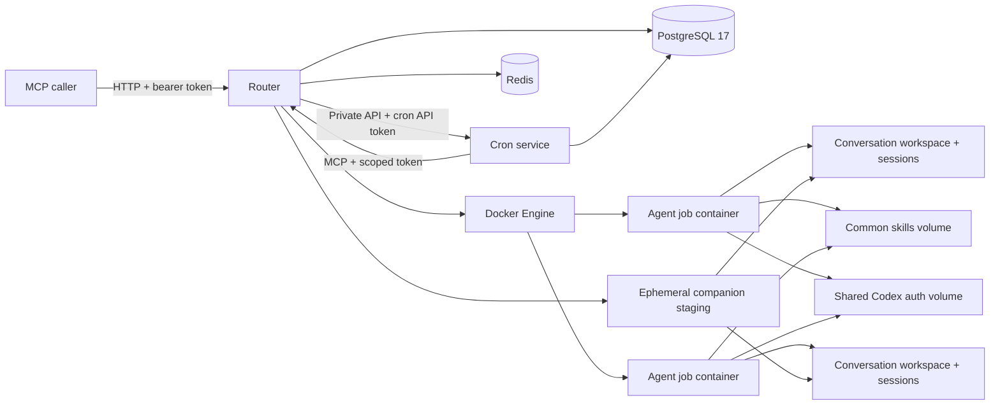

# RemoteAgent

RemoteAgent is an internal HTTP MCP router for any number of isolated,
containerized Codex CLI agents, with a sibling cron service for durable scheduled
turns. Each agent is a top-level Docker Compose project. The router discovers
and registers their manifests, accepts prompts as durable asynchronous jobs,
maps opaque conversation keys to exact Codex thread IDs, and publishes
agent-created files as MCP resources. Callers can also stage documents,
archives, or public HTTPS Git repositories and bind them to a turn as editable
conversation companions.

The repository includes two default-enabled built-ins: `joke-agent` provides
one clean, prompt-influenced joke and doubles as the continuation smoke target;
`repository-critic` reviews a complete repository companion against its own
documentation, runs supported tests and coverage, and publishes evidence-backed
review artifacts without using pull-request or diff framing.

The maintained documentation index is [docs/README.md](docs/README.md). The
[requirements baseline](docs/requirements.md) is the starting point for scoped
future changes; each behavior has a stable requirement ID, implementation
status, acceptance method, and evidence.

## Quick start

Requirements: Linux, Docker Engine, Docker Compose v2, Bash, and access to a
ChatGPT account with Codex. Clone the repository on the internal server, then:

```sh
make init
make build-all
make skills-sync
make auth-login
make start
make doctor
```

`make auth-login` uses the Codex device-code flow suitable for a headless host.
The browser link and one-time code are printed in the terminal. The resulting
credential cache is stored in the `remoteagent-codex-auth` Docker volume; it is
never committed or included in RemoteAgent backups.

The MCP endpoint is `http://SERVER:8080/mcp`. Configure callers with the bearer
token stored at `.runtime/secrets/router_bearer_token`:

```sh
scripts/remotectl token print
```

V1 intentionally uses HTTP plus one full-access external bearer token on a
trusted internal network. Two independent service tokens remain inside the
backend network. Put the router behind TLS before crossing an untrusted boundary.

## How it fits together



Jobs are asynchronous: submit a prompt, retain its job ID and conversation key,
poll status, then retrieve the result. A continuation is serialized within its
conversation and resumes the exact stored Codex thread ID rather than using a
global “last session.” A new-conversation request may also select a Codex
`model` and `reasoning_effort`. The router stores that nullable execution profile
for the conversation, returns it with accepted jobs and job status, and
reapplies each non-null value on every resume. On a new conversation, omitting
either selector uses the agent's explicit Codex setting and then Codex/account
inheritance; an inherited value is represented as
`null`, not guessed by the router. Only non-null values are pinned; `null`
remains dynamic inheritance and may follow a later agent revision or Codex
account default.

The 20-tool MCP surface includes agent discovery/details/registration, immutable
config-context revisions, prompt submission/status/cancellation, companion Git
staging/status/listing, artifact listing, conversation archival/deletion, and
cron schedule/response management.
Agent configurations and completed artifacts are also exposed as `agent://...`
and `artifact://...` MCP resources.
Artifacts above the MCP transfer limit remain available from the authenticated
HTTP content endpoint with range requests.

Companion uploads use REST because MCP requests are capped at 4 MiB. Upload or
queue an import, poll Git stages until `ready`, then include the returned
single-use stage ID and a safe name in `PromptRequest.companions`. The agent sees
the persistent editable working copy at `/workspace/companions/<name>` on that
turn and later turns. A same-name binding atomically replaces the old working
copy; outputs intended for callers still belong in `/workspace/artifacts`.

The operational dashboard is at `http://SERVER:8080/dashboard/login`; it uses
the same bearer token to create a short-lived server-side browser session.
Prometheus metrics are available at the bearer-protected `/metrics` endpoint.

Client implementers should use the [API guide](docs/api.md). REST code generators
can consume the checked-in [OpenAPI 3.1 contract](docs/api/openapi.json). MCP
clients should use standard runtime discovery; normalized snapshots of the
server's standard [`tools/list`](docs/api/mcp-tools-list.json) and
[`resources/templates/list`](docs/api/mcp-resource-templates-list.json)
responses are checked in for review and offline generation.
The sibling service's [internal OpenAPI contract](cron/openapi.json) is for
router-to-cron compatibility and does not add public REST routes.

## Repository layout

- `compose.yaml` — router, cron scheduler, PostgreSQL, Redis, and Codex auth helper.
- `router/` — Python MCP/router service.
- `cron/` — Python cron scheduler, private API, persistence, and migrations.
- `runtime/` — pinned router, cron, and Codex runner images and entrypoints.
- `phonebook.toml` — checked-in seed registry.
- `<agent-id>/` — one top-level Compose project per agent.
- `common-skills/` — source used to seed the shared skills volume.
- `templates/agent/` — starter files for `remotectl agent new`.
- `scripts/remotectl` — supported deployment and maintenance CLI.
- `.runtime/` — ignored secrets and per-conversation runtime state.

## Common operations

```sh
scripts/remotectl status
scripts/remotectl logs router --follow
scripts/remotectl logs cron --follow
scripts/remotectl migrate status all
scripts/remotectl token status all
scripts/remotectl agent list
scripts/remotectl agent validate joke-agent
scripts/remotectl agent validate repository-critic
scripts/remotectl backup create
scripts/remotectl cleanup                 # dry-run
scripts/remotectl smoke network
scripts/remotectl smoke live --agent joke-agent
scripts/remotectl smoke live --agent repository-critic --timeout 900
```

The network smoke invokes app-server `command/exec` directly and consumes no
model or authentication capacity. Live smoke consumes authenticated Codex
subscription capacity and is hard disabled in CI. Ordinary tests use a
deterministic fake runner.

The critic is the only checked-in agent that opts into managed command
networking, used for credential-free project dependencies in disposable
scratch. Other agents remain network-off. The native Codex policy admits only
`example.com`, `pypi.org`, `files.pythonhosted.org`, `registry.npmjs.org`,
`proxy.golang.org`, and `sum.golang.org`. Filtering is by hostname rather than
scheme, port, or method, so use a separate host or L7 egress control if stricter
protocol enforcement is required.

See the [requirements baseline](docs/requirements.md), [API contract](docs/api.md),
[Docker runtime contract](docs/docker-runtime.md), [deployment](docs/deployment.md),
[operations](docs/operations.md), [agent authoring](docs/agent-authoring.md),
[architecture](docs/architecture.md), and [security](docs/security.md) for the
full specification and runbook.

## Authentication note

The implementation follows official OpenAI guidance for
[headless Codex authentication](https://learn.chatgpt.com/docs/auth) and
[non-interactive exact-session resume](https://learn.chatgpt.com/docs/non-interactive-mode).
ChatGPT-managed credentials are appropriate only on this trusted internal host;
API-key or workload-identity support can be selected later without changing the
router's job/conversation interface.
