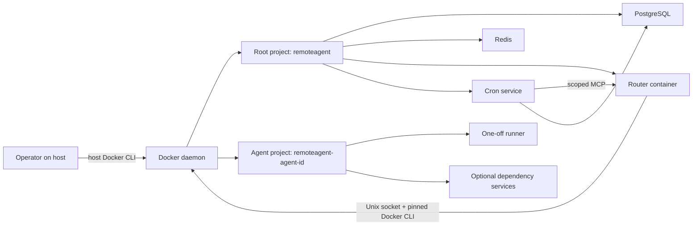

# Docker Runtime and Compose Contract

This document defines the production Docker and Docker Compose contract for
RemoteAgent as it is implemented in this repository. It covers the root control
plane, per-agent Compose projects, one-off Codex runner containers, dependency
services, storage, lifecycle commands, backup boundaries, and failure recovery.

The key words **MUST**, **MUST NOT**, **REQUIRED**, **SHOULD**, **SHOULD NOT**, and
**MAY** are normative requirements for reviewed deployments and agent projects.
Where the implementation does not yet enforce a requirement automatically, the
text marks it as **review-enforced**. A requirement marked **code-enforced** is
validated by the router, `scripts/remotectl`, Docker Compose, or a combination of
those components.

RemoteAgent V1 assumes:

- one RemoteAgent installation per Docker daemon;
- one active router and one active cron container;
- a dedicated Linux host on a trusted internal network;
- trusted repository maintainers and reviewed agent Compose definitions; and
- one operator-facing bearer with full access plus two narrowly scoped internal
  cron/router service tokens.

It is not a safe multi-tenant container platform.

## Supported and tested platform

The current reference deployment has been verified with:

- Ubuntu 24.04 LTS on x86-64;
- Docker Engine client and daemon 29.7.2;
- Docker Compose 5.4.0;
- cgroup v2; and
- the Docker seccomp and AppArmor security modules enabled on the host.

These versions are the tested baseline, not a claimed minimum-version matrix.
Alternative versions MUST support every Compose feature used by this repository:

- top-level project names;
- service profiles;
- `docker compose config --format json`;
- long-form `depends_on` health conditions;
- `docker compose up --wait --wait-timeout`;
- file-backed Compose secrets;
- build-network selection;
- external named volumes; and
- service security, tmpfs, PID, memory, and CPU settings.

The host MUST provide:

- a dedicated Linux Docker daemon reachable through a Unix socket;
- permission for the deployment operator to use that daemon;
- Bash, Python 3, `curl`, `git`, `tar`, `sha256sum`, `realpath`, GNU `date`,
  `find`, `sort`, `awk`, `sed`, `hostname`, `df`, and ordinary core utilities;
- `flock` for production-safe serialization of administrative mutations;
- `openssl`, or access to `/dev/urandom` through the helper's fallback path;
- outbound DNS and HTTPS for image builds, ChatGPT/Codex authentication, model
  traffic, and any explicitly permitted agent web access;
- correct system time for TLS and authentication;
- a firewall that restricts the router port to intended callers; and
- sufficient monitored storage for images, PostgreSQL, conversations, Codex
  sessions, artifacts, logs, backups, and agent dependency volumes.

The host kernel and Docker security configuration MUST allow the agent image's
nested Bubblewrap sandbox when the reviewed runner settings
`seccomp=unconfined` and `apparmor=unconfined` are applied. Run
`scripts/remotectl doctor` after every Docker, kernel, AppArmor, or Codex CLI
upgrade. A failed inner-sandbox probe is a deployment blocker.

Conversation storage has no per-conversation byte quota in V1. If a dedicated
or quota-controlled filesystem is used, mount it at the repository's `.runtime`
path. The supported helper validates `REMOTEAGENT_STATE_ROOT` as exactly
`<repository>/.runtime`; changing the environment variable to an unrelated path
is not a supported substitute for mounting storage there.

## Compose control planes

RemoteAgent uses two independent Compose control planes:

1. The root project, normally named `remoteagent`, owns the router, cron,
   PostgreSQL, Redis, the authentication helper, core networks, core volumes,
   and core secrets.
2. Each agent owns a project named exactly `remoteagent-<agent-id>`. It contains
   the one-off runner service and any agent-specific dependency services.



Operator commands use the host's Docker CLI and current Docker context. The
router uses the socket bound from `REMOTEAGENT_DOCKER_SOCKET` at
`/var/run/docker.sock` and sets `DOCKER_HOST=unix:///var/run/docker.sock` inside
the container. Both paths MUST target the same daemon. A custom socket deployment
MUST configure the host CLI/context consistently; current validation does not
compare daemon identities.

The router image pins Docker CLI 29.7.2 and includes its Compose plugin. The host
CLI is not supplied by the repository and is the operator's responsibility.

## Root project

### Core service matrix

| Service | Image and process | Networks and ports | Persistent inputs | Health and lifecycle | Isolation and limits |
| --- | --- | --- | --- | --- | --- |
| `postgres` | `postgres:17.6-alpine` | `backend`; no host port | `postgres-data`; `postgres_password` secret | `pg_isready`; `restart: unless-stopped` | Read-only root; writable data volume; bounded `/run/postgresql` and `/tmp` tmpfs; no explicit CPU, memory, or PID limit |
| `redis` | `redis:7.4.5-alpine`, AOF enabled with `appendfsync everysec`, periodic RDB enabled | `backend`; no host port | `redis-data` | `redis-cli ping`; `restart: unless-stopped` | Read-only root; writable data volume; bounded `/tmp`; no explicit CPU, memory, or PID limit |
| `router` | `remoteagent/router:<version>`, non-root UID/GID, Uvicorn under `tini` | `edge` and `backend`; publishes `<bind-address>:<port>:8080` | repository bind, state bind, Docker socket, `router-data`, bearer/database secret files | Waits for healthy PostgreSQL and Redis; HTTP `/healthz`; `restart: unless-stopped` | Read-only root; bounded `/tmp`; `no-new-privileges`; Docker socket group; no explicit CPU, memory, or PID limit |
| `cron` | `remoteagent/cron:<version>`, non-root UID/GID, Uvicorn under `tini`, system IANA `tzdata` | `backend` only; no host port | PostgreSQL password plus scoped MCP and internal API secrets; no volume/bind | Waits for healthy PostgreSQL/router; Compose checks authenticated `/readyz` (database, schema, and MCP handshake), while `/healthz` remains public liveness; `restart: unless-stopped` | Read-only root; 64 MiB `/tmp`; all capabilities dropped; `no-new-privileges`; 512 MiB, 1 CPU, 128 PIDs |
| `codex-auth` | `remoteagent/agent-base:<version>`, profile `tools`, one-off `codex` process | `edge`; no host port | shared `codex-auth` and `common-skills` volumes | No long-running healthcheck or restart policy; invoked with `compose run --rm` | Non-root image user and `no-new-privileges`; filesystem remains writable because login must update credentials |

The root service anchor applies the local `json-file` logging driver with a 10 MiB
file limit and five retained files to PostgreSQL, Redis, router, and cron. Agent
projects do not inherit this anchor.

The root project is started with `postgres`, `redis`, `router`, and then `cron`. The
`codex-auth` service is behind the `tools` profile and is used only for login,
logout, import, and status commands.

### Root networks

The root project creates:

- `<project>-edge`, a normal bridge network used by the router and auth helper;
- `<project>-backend`, an `internal: true` bridge network used by the router,
  cron, PostgreSQL, and Redis.

Cron, PostgreSQL, and Redis MUST NOT publish host ports. The router is the only root
service intended to accept host-network traffic. The backend network prevents
PostgreSQL and Redis from obtaining normal external bridge egress, while the
router can reach both the backend services and its edge-facing callers.
That edge attachment also provides router egress for optional public HTTPS Git
companion imports. Application validation restricts URLs, globally routable
pinned addresses, redirects, credentials, and Git protocols, but Compose does
not provide a host-level egress allowlist; operators should add one when the
threat model requires defense in depth.

Agent projects do not join the root backend network. A dependency service is
reachable by a runner only when both services join an agent-owned network.

### Root volumes, binds, and secrets

| Storage | Mounted by | Purpose | Persists after `stop`/`down` | RemoteAgent backup coverage |
| --- | --- | --- | --- | --- |
| `<project>-postgres-data` | PostgreSQL | Authoritative SQL files | Yes; `down` omits `-v` | Logical contents included as `pg_dump`; raw volume is not copied |
| `<project>-redis-data` | Redis | AOF/RDB accelerator state and dashboard sessions | Yes | No; Redis is recoverable/non-authoritative application state |
| `<project>-router-data` | Router at `/var/lib/remoteagent` | Reserved mount | Yes | No; current application state is directed to the host state bind and does not rely on this volume |
| `remoteagent-codex-auth` or configured equivalent | Auth helper and every runner | File-backed Codex credentials and shared `$CODEX_HOME` state | Yes | No; credentials must be reprovisioned separately |
| `remoteagent-common-skills` or configured equivalent | Auth helper and every runner | Common skill tree | Yes | No; checked-in `common-skills/` is the source of truth |
| Repository bind | Router, read-only at the same absolute path | Phonebook and agent Compose definitions | Host filesystem | No; protect the Git repository separately |
| `.runtime` bind | Router, read-write at the same absolute path | Secrets, conversations (including accepted companions), ephemeral companion staging, served artifacts, backups, locks, and validation paths | Host filesystem | Complete conversations and artifact store are captured; unclaimed companion staging is excluded |
| `postgres_password` | PostgreSQL, router, and cron as `/run/secrets/...` | Database password | Host secret file persists | No |
| `router_bearer_token` | Router as `/run/secrets/...` | HTTP/MCP authorization | Host secret file persists | No |
| `cron_mcp_token` | Router and cron as `/run/secrets/...` | Authorizes cron's five-tool MCP role | Host secret file persists | No |
| `cron_api_token` | Router and cron as `/run/secrets/...` | Authorizes router access to cron `/internal/v1` | Host secret file persists | No |
| Agent-defined volume | Dependency service or runner extension | Agent-specific state | Normally yes unless explicitly deleted | No; the agent owner MUST provide a separate backup and restore procedure |

Compose secrets in this deployment are file-backed local Compose mounts, not
Docker Swarm secrets. Their host sources live under `.runtime/secrets`, MUST be
mode 0600 or otherwise inaccessible to group and world, and MUST never be copied
into images, Git, logs, agent context, or backups.

No supported helper runs `docker compose down -v`, `docker volume prune`, or
`docker system prune`.

### Cron service boundary

Cron has no Docker socket, repository/state bind, Redis configuration/dependency, edge
network, Codex auth, or agent volume. It communicates only with PostgreSQL and
the router on `backend`. The Host allowlist MUST contain `router:8080` for its
MCP connection. Router startup is intentionally independent of cron; cron has a
one-way health dependency on router so there is no Compose cycle. A cron outage
therefore degrades schedule management/execution but does not fail core router
readiness.

The cron image owns `/opt/remoteagent/cron/alembic.ini` and its migration tree.
Its tables and `cron_alembic_version` share the PostgreSQL database but have no
foreign keys to router tables. Startup applies the cron chain before Uvicorn;
`remotectl migrate` can inspect or apply either chain independently.

## Same-path bind contract

`scripts/remotectl init` writes absolute values for:

- `REMOTEAGENT_REPO_ROOT`; and
- `REMOTEAGENT_STATE_ROOT`.

The root Compose project mounts each path into the router at the identical
absolute path. This is REQUIRED because agent Compose commands execute inside the
router container but their bind source paths are interpreted by the host Docker
daemon. A container-only path translation would cause the daemon to mount the
wrong host directory or create an empty directory.

The router and all runners use the host operator's numeric UID/GID by default.
Runtime directories MUST be writable by that identity. The router is added to
the numeric group that owns the Docker socket.

Each conversation is materialized below:

```text
.runtime/conversations/<conversation-key>/
├── inputs/
│   └── objects/<companion-id>/
├── workspace/
│   ├── companions/<name> -> ../.remoteagent/companions/<companion-id>
│   └── .remoteagent/
│       ├── companions/<companion-id>/
│       └── jobs/<job-id>/final.txt
├── sessions/
├── artifacts/
└── control/
    ├── AGENTS.md
    └── config.toml
```

Ready but unclaimed acquisition state lives separately at
`.runtime/companion-staging/<stage-id>/`. It is owner-only, expiring, and not a
backup input. Accepted source objects are immutable and remain outside
`workspace`; the versioned working copies inside `workspace/.remoteagent` are
editable. This split prevents an earlier active turn from observing a companion
accepted for a future sequence. The stable name is switched atomically only
after a complete working copy is ready.

The agent runner uses deliberately nested mounts in this order:

1. the shared auth volume at `/home/agent/.codex`;
2. the isolated conversation sessions bind at
   `/home/agent/.codex/sessions`;
3. the isolated workspace bind at `/workspace`;
4. the isolated artifact bind at `/workspace/artifacts`;
5. the common skills volume at `/opt/remoteagent/skills`, read-only;
6. the effective revision's `AGENTS.md` at `/workspace/AGENTS.md`, read-only; and
7. the effective revision's `config.toml` at
   `/home/agent/.codex/config.toml`, read-only.

Agent Compose files MUST NOT shadow these paths with additional mounts. The
sessions bind prevents shared `$CODEX_HOME` rollout files from causing one
conversation to resume another conversation's thread. The config and context
mounts prevent a running prompt from modifying its effective agent revision.

## Agent project contract

### Required repository layout

Each supported agent MUST occupy one top-level directory whose name exactly
matches its lowercase agent ID:

```text
<agent-id>/
├── agent.toml
├── compose.yaml
├── Dockerfile
├── AGENTS.md
└── config.toml
```

The supported helper requires the Compose filename to be exactly `compose.yaml`,
even though the lower-level runtime API can validate another contained filename.
All manifest, Compose, config, and context paths MUST resolve within the agent's
own top-level directory. Symlink and traversal escapes are code-enforced.

The manifest MUST declare:

- `id` matching the directory name;
- `project_name = "remoteagent-<agent-id>"` or omit it so that exact value is
  populated;
- `runner_service` naming the one-off Codex service;
- every operational sidecar in `dependency_services`;
- `compose_file = "compose.yaml"` for supported helper compatibility; and
- an enabled state, config source, and base-context source.

Only a Compose file already present beneath the agent directory can be
registered. MCP/REST registration does not upload or create a Compose project.

### Runner service

The runner service MUST:

- use `remoteagent/<agent-id>:<version>` so `remotectl doctor` can verify the
  expected image;
- inherit from `remoteagent/agent-base:<version>` unless a reviewed platform
  image provides an equivalent contract;
- retain `/usr/local/bin/remoteagent-agent-entrypoint` so mount validation, Git
  workspace initialization, and the common-skills link execute before Codex;
- use profile `runner` so a general project `up` does not start an idle runner;
- run as `${REMOTEAGENT_UID}:${REMOTEAGENT_GID}`;
- declare the workspace, sessions, artifacts, auth, and skills mounts described
  above;
- join an agent-owned egress network shared with its declared dependencies;
- avoid a restart policy because every turn is a one-off container;
- avoid `container_name`; the router supplies a unique job name at runtime;
- avoid host-published ports;
- avoid the Docker socket and all unrelated host paths; and
- contain all executable dependencies before a prompt is accepted for live
  processing. Runtime package installation is not supported.

Manifest `[environment]` values are passed to the Docker Compose CLI as safe
interpolation inputs. They are **not** automatically injected into the runner.
For a value to reach a container, `compose.yaml` must explicitly reference it,
for example:

```yaml
services:
  agent:
    environment:
      EXAMPLE_SETTING: ${EXAMPLE_SETTING}
```

Router/database credentials, Docker controller variables, job path variables,
and other reserved names are rejected from manifest environment tables.

Manifest `[labels]` values are registry metadata. They are not automatically
applied as Docker object labels. Docker labels required for lifecycle or cleanup
MUST be present in the Compose service definition.

### Runner security and resource requirements

The reviewed runner service MUST retain:

```yaml
user: ${REMOTEAGENT_UID:-1000}:${REMOTEAGENT_GID:-1000}
read_only: true
tmpfs:
  - /tmp:size=64m,mode=1777
cap_drop: ["ALL"]
security_opt:
  - no-new-privileges:true
  - seccomp=unconfined
  - apparmor=unconfined
pids_limit: 256
mem_limit: ${REMOTEAGENT_AGENT_MEMORY_LIMIT:-2g}
cpus: ${REMOTEAGENT_AGENT_CPU_LIMIT:-2.0}
```

The two `unconfined` settings permit the inner managed Bubblewrap sandbox to
create the namespaces it needs on the reference host. They do not grant approval
to remove the non-root user, read-only root, capability drop,
`no-new-privileges`, limits, isolated mounts, or the root-owned managed Codex
requirements file.

An agent Compose project MUST NOT use:

- `privileged: true`;
- host PID, IPC, or network namespaces;
- added Linux capabilities;
- the Docker socket or another container runtime socket;
- arbitrary host binds;
- writable common-skills mounts;
- an unbounded writable root filesystem;
- a root runner user; or
- host-published dependency or runner ports without a reviewed platform
  exception.

These isolation properties are currently review-enforced. Current automatic
Compose validation resolves the real Compose model, verifies required service
names, and verifies a basic dependency healthcheck, but it does not yet reject
unsafe mounts, namespaces, privileges, ports, users, capabilities, missing
limits, or an unexpected image.

### Required Docker labels

The runner Compose service MUST define:

| Label | Value |
| --- | --- |
| `io.remoteagent.managed` | `"true"` |
| `io.remoteagent.instance` | `${REMOTEAGENT_INSTANCE_ID}` |
| `io.remoteagent.agent.id` | Agent ID |
| `io.remoteagent.job.id` | `${REMOTEAGENT_JOB_ID}` |
| `io.remoteagent.conversation.key` | `${REMOTEAGENT_CONVERSATION_KEY}` |

The router also supplies `remoteagent.job_id=<job-id>` on `docker compose run`.
Both job labels currently exist; cleanup selects containers using
`io.remoteagent.managed=true` and the exact `io.remoteagent.instance` value.

Dependency services SHOULD carry `io.remoteagent.managed`, instance, agent ID,
and a service-role label if future reconciliation or operator tooling is expected
to discover them. Current dependency lifecycle does not require or query those
labels.

### Enforcement matrix

| Contract item | Current enforcement |
| --- | --- |
| Agent ID syntax and directory identity | Code-enforced |
| Project name exactly `remoteagent-<agent-id>` | Code-enforced |
| Compose/config/context remain inside agent directory | Code-enforced |
| Referenced runner and dependency services exist | Code-enforced after resolved Compose model |
| Declared dependency has an enabled, non-empty healthcheck test | Code-enforced |
| Config approval `never`, file credential store, and read-only/workspace-write sandbox | Code-enforced |
| No duplicate dependencies and runner not also a dependency | Code-enforced |
| Healthcheck timing and semantic quality | Review-enforced |
| Runner image/tag/profile/entrypoint | Review-enforced |
| Required mounts and mount ordering | Review-enforced |
| Non-root, read-only root, capabilities, security options, and limits | Review-enforced |
| No `container_name`, host namespace, socket, arbitrary bind, or published port | Review-enforced |
| Required Docker labels and bounded logging | Review-enforced |
| Complete declaration of transitive operational dependencies | Review-enforced |
| Sidecar backup and restore procedure | Review-enforced |

## Dependency services

An agent MAY declare databases, browsers, local services, or other operational
dependencies in `dependency_services`. The services are part of the agent's
Compose project, not the root project.

Every operational service, including a service otherwise reached transitively
through Compose `depends_on`, MUST appear in `dependency_services`. Docker
Compose may start transitive services automatically, but the current router only
validates, reference-counts, and stops the names in the manifest. Hidden
transitive services can otherwise remain running outside router accounting.

Each dependency MUST:

- have a meaningful enabled healthcheck;
- define finite `start_period`, interval, timeout, and retry values suitable for
  the router's overall Compose wait timeout;
- join the same private agent network as the runner;
- avoid a host-published port unless explicitly reviewed;
- define bounded CPU, memory, PID, and log-retention settings;
- pin material image versions;
- avoid runtime package installation; and
- document whether its state is ephemeral or durable.

If durable state is stored in an agent-defined named volume, the agent owner MUST
provide independent backup, verification, restore, retention, and upgrade
instructions. RemoteAgent's core backup does not include agent volumes.

Dependency services are shared per agent project. They are not cloned per
conversation. A dependency MUST therefore either be stateless or implement
conversation isolation using `REMOTEAGENT_CONVERSATION_KEY` or another reviewed
tenant key. Do not assume a dedicated database container implies a dedicated
database per conversation.

The lifecycle is:

1. While holding the deployment-wide execution lease, the router executes
   `docker compose up -d --wait --wait-timeout <seconds> <dependencies...>`.
2. Compose starts the requested services and its dependency graph, applies
   service ordering, and waits for running/healthy state.
3. Any failure fails the job before Codex starts.
4. The router runs the agent with `docker compose run --rm --no-deps`; runner
   `depends_on` is intentionally not used for job ordering.
5. After the last reference is released, dependencies remain warm for
   `REMOTEAGENT_DEPENDENCY_WARM_SECONDS`.
6. Warm expiry executes `docker compose stop --timeout <seconds>
   <dependencies...>`.

Warm expiry stops containers; it does not execute `docker compose down`, remove
containers, remove the project network, or remove volumes. A zero warm duration
causes an asynchronous stop as soon as the reference count reaches zero.

A graceful router shutdown stops dependencies that were observed by that router
process. A forced router/container/daemon failure can leave dependencies running
because reference counts are held in router memory and startup recovery currently
reconciles job containers, not dependency services.

Image-only dependency services are not necessarily downloaded by
`scripts/remotectl build all`, which invokes Compose build targets. Operators
SHOULD pre-pull and verify all image-only sidecars before admitting live work;
otherwise Compose may pull an absent image during the first prompt.

## One-off job lifecycle

```mermaid
sequenceDiagram
    participant C as MCP/HTTP caller
    participant R as Router
    participant P as PostgreSQL
    participant D as Docker Compose
    participant S as Dependency services
    participant A as Agent runner

    C->>R: Upload or queue Git companion (optional)
    R->>P: Persist stage lifecycle
    R-->>C: Return/poll single-use stage ID until ready
    C->>R: Submit prompt with ready bindings
    R->>P: Atomically persist job, claimed stages, and companion versions
    R-->>C: Return job ID and companion additions immediately
    R->>P: Claim eligible turn and acquire execution lease
    R->>R: Activate/repair sequence-visible companion working copies
    R->>R: Materialize workspace, sessions, artifacts, config, and context
    R->>D: compose up -d --wait declared dependencies
    D->>S: Start/order services and evaluate healthchecks
    S-->>D: Healthy
    D-->>R: Dependencies ready
    R->>D: compose run --rm --no-deps runner + Codex command
    D->>A: Create exact-named one-off container
    R->>A: Prompt over stdin
    A-->>R: Codex JSONL events and final response
    R->>P: Persist exact thread ID, result, usage, and terminal state
    R->>R: Hash and ingest changed artifacts
    R->>D: Confirm exact runner removal
    R->>R: Release dependency reference; schedule warm stop
    C->>R: Poll job status / retrieve result and artifacts
```

The effective runtime command is structurally:

```text
docker compose \
  -f <agent-directory>/compose.yaml \
  -p remoteagent-<agent-id> \
  run --rm --no-deps -T \
  --name remoteagent-<job-id-with-underscores-replaced> \
  --label remoteagent.job_id=<job-id> \
  --volume <control>/AGENTS.md:/workspace/AGENTS.md:ro \
  --volume <control>/config.toml:/home/agent/.codex/config.toml:ro \
  -e REMOTEAGENT_JOB_ID \
  -e REMOTEAGENT_CONVERSATION_KEY \
  <runner-service> \
  codex exec [--model <model>] \
    [-c 'model_reasoning_effort="<effort>"'] ...
```

A new conversation runs `codex exec --json ... -`. A continuation runs
`codex exec resume --json <exact-thread-id> -`; it never uses a global “last”
session. When the conversation has a non-null model or reasoning effort, the
router supplies the same one-run override on both the new and resume commands.
At conversation creation, caller input takes precedence over explicit
`model`/`model_reasoning_effort` values in the agent config. The stored non-null
result then takes precedence over the config mounted for each turn. If a stored
field is null, the router omits that override and the current mounted agent
revision, followed by Codex/account inheritance, remains authoritative.
The prompt is written to stdin. Stdout is parsed as JSONL. Raw stderr is bounded
in memory and is not persisted because it may contain private material.

When a turn has active companions, the prompt written to stdin is the
router-owned versioned companion preamble followed by the exact caller prompt.
The database retains the raw prompt; runtime metadata records visible companion
IDs/preamble version, and usage estimation sees the effective prompt. Without
active companions, the input bytes are unchanged. Preparation and stable-link
repair complete before the runner starts; failure therefore cannot expose a
partial replacement to Codex.

The execution and login contracts track the official OpenAI documentation for
[Codex non-interactive mode](https://learn.chatgpt.com/docs/non-interactive-mode)
and [Codex authentication](https://learn.chatgpt.com/docs/auth). Command-level
model selection uses OpenAI's documented
[one-off configuration overrides](https://learn.chatgpt.com/docs/config-file/config-advanced#one-off-overrides-from-the-cli),
preferring the dedicated `--model` flag and using `--config` for the reasoning
setting.

Cancellation first terminates the Compose client process, waits ten seconds, and
kills it if necessary. The router then attempts exact-name `docker rm -f` even
though `compose run --rm` normally removes the container. On router startup,
durably interrupted job IDs are mapped back to their exact container names for
best-effort cleanup.

## Administrative Docker interactions

Use `scripts/remotectl` or its Make targets as the supported operational
interface. Direct Docker commands are diagnostic tools and MUST be scoped to the
exact root or agent project.

| Command | Docker interaction | Persistent effect | Idle/drain behavior |
| --- | --- | --- | --- |
| `remotectl init` | Inspects daemon socket ownership; no containers | Creates/updates `.env`, directories, allowlists, and restricted secret files | No job check |
| `remotectl bootstrap` | Initializes, builds all, syncs skills, authenticates if needed, and starts core | Full first deployment | Interactive unless `--non-interactive`; non-interactive fails if auth is absent |
| `remotectl validate --all` | Resolves root and every agent Compose model | None | Safe while running |
| `remotectl build core` | Builds router, cron, and agent-base through the `codex-auth` service definition | Creates/replaces tagged local images | Does not stop services; use reviewed change procedure for live image replacement |
| `remotectl build all` | Builds core and declared runner/dependency build targets | Creates/replaces local images | Does not pre-pull image-only dependencies unless flags/workflow do so |
| `remotectl skills sync` | Creates/mounts the skills volume in a disposable root container | Merges checked-in skills; `--prune --yes` deletes stale volume entries | Does not stop jobs; schedule every sync while idle so runners do not observe a partial update |
| `remotectl auth status` | Disposable no-dependency auth helper | Normally read-only status | Safe while running |
| `remotectl auth login/import/logout` | Disposable auth helper with shared auth volume | Mutates credentials | Code-enforced router stop requirement |
| `remotectl token rotate TARGET --yes` | Rewrites the selected router/cron token files; internal rotation recreates router and cron together | Invalidates selected external callers or synchronizes service credentials | Recreate can interrupt active jobs; coordinate an idle window |
| `remotectl start` | Validates, then `up -d --wait` for PostgreSQL, Redis, router, and cron | Reuses existing volumes | Starts cron only after healthy router; does not start agent images or sidecars |
| `remotectl stop` | `compose stop` for cron, router, Redis, and PostgreSQL | Preserves containers, networks, and volumes | No idle check; normal stop can interrupt a running job |
| `remotectl stop --force` | `compose kill` for core services | Preserves containers and volumes | Abrupt; likely leaves interrupted work and possibly sidecars |
| `remotectl restart` | Sequential stop and start | Preserves volumes | No idle check; can interrupt jobs |
| `remotectl down` | Root-project `compose down --remove-orphans`, without `-v` | Removes root containers/networks; preserves named volumes | No idle check; does not tear down agent projects |
| `remotectl migrate status/apply [router\|cron\|all]` | Starts PostgreSQL and uses disposable router/cron containers | Reads or updates independent database schema chains | Defaults to all; apply should be part of a reviewed maintenance window |
| `remotectl agent build` | Builds agent-base, runner, and declared dependency build targets | Creates/replaces tagged images | Does not register definition |
| `remotectl agent register` | No direct Docker mutation after validation | Persists immutable definition revision in PostgreSQL | Safe; queued jobs retain their submitted revision |
| `remotectl backup create` | Quiesces cron, stops an idle router, uses `pg_dump`, archives state, restarts router then cron | Writes restricted checksum-protected archive including cron tables | Cron stops before the code-enforced router idle check |
| `remotectl backup verify` | No daemon mutation | None | Safe while running |
| `remotectl restore FILE --yes` | Stops cron/router/Redis, transactionally replaces the application schema, swaps state trees, then starts router before cron | Destructively replaces backed-up state including cron state | No automatic pre-restore backup; successful restore returns both services healthy |
| `remotectl cleanup` | Lists old exited/dead instance-labelled managed containers | Dry-run only | Does not inspect or delete data |
| `remotectl cleanup --apply --yes` | Removes only selected terminal labelled containers | Container deletion only | Does not stop running sidecars or remove volumes/networks |
| `remotectl doctor` | Read-only inspection plus no-network sandbox/auth probes and authenticated cron readiness | None | Safe; cron readiness proves database/schema/scoped-MCP connectivity |
| `remotectl upgrade apply --yes` | Cron quiesce, idle router stop, backup, pull/build all, recreate router then cron with health wait | New images and a pre-upgrade backup | Run idempotent `init --non-interactive` first after a 0.1 checkout switch; then clean-tree and idle checks apply |
| `remotectl smoke live` | Runs two normal asynchronous turns through the router | Deletes a successful smoke conversation unless `--keep`; failed smoke identifiers are retained | Consumes authenticated Codex capacity; disabled in CI |

Administrative mutations use a host lock when `flock` is installed. Production
hosts MUST provide `flock`; without it, the helper cannot exclude two concurrent
mutating operator commands.

## Build and image expectations

The root image tags are:

- `remoteagent/router:${REMOTEAGENT_VERSION}`;
- `remoteagent/cron:${REMOTEAGENT_VERSION}`; and
- `remoteagent/agent-base:${REMOTEAGENT_VERSION}`.

The supported agent tag is:

- `remoteagent/<agent-id>:${REMOTEAGENT_VERSION}`.

The router and cron images pin their Python base; the router additionally pins
its Docker CLI/Compose source image. The
agent base pins Node and Codex CLI and preinstalls Python, Git, ripgrep,
Bubblewrap, build tools, and other general utilities. Each agent Dockerfile MUST
install and pin its additional dependencies during image build.

`REMOTEAGENT_BUILD_NETWORK=default` is the normal build setting. On a dedicated
Linux builder whose bridge cannot reach package mirrors, an operator MAY select
`host`, but that gives Dockerfile `RUN` steps host-network access and MUST NOT be
used on a shared builder.

Building a new tag does not mutate a running container. Recreating the router or
starting a new one-off runner is what activates a newly tagged image. Keep prior
images until migrations, discovery, doctor, and a live smoke test have passed.

## Backup and disaster recovery boundary

### Included and excluded data

| Data | Included | Recovery behavior |
| --- | --- | --- |
| PostgreSQL router and cron application state | Yes, custom-format `pg_dump` | Fully rendered, then restored with `--no-owner` after a same-transaction `public` schema reset |
| `.runtime/conversations` | Yes | Complete tree replacement, including accepted immutable companion sources, editable working copies, and stable links |
| `.runtime/companion-staging` | No | Ephemeral unclaimed data is reacquired; restored stage rows without bytes reconcile to failed/expired |
| `.runtime/artifact-store` | Yes | Complete tree replacement |
| Archive manifest and SHA-256 checksums | Yes | Verified before extraction and again during restore |
| Redis data and dashboard sessions | No | Redis/cache state is rebuilt; browser dashboard sessions may be lost |
| Codex auth volume | No | Run authentication again or restore through a separately protected credential procedure |
| Common-skills volume | No | Rebuild agent-base and run `remotectl skills sync` |
| Router/cron bearer tokens and PostgreSQL password | No | Retain or rotate restricted deployment secrets and update external callers as needed |
| `.env` | No | Recover from secured deployment configuration management |
| Git repository and agent definitions | No | Recover the reviewed release checkout separately |
| Images and build cache | No | Rebuild from the reviewed checkout and pins |
| `router-data` volume | No | No current authoritative application payload relies on it |
| Agent dependency volumes | No | Follow the agent-specific backup/restore runbook |
| Container logs | No | Export through the deployment's logging system if retention is required |

Backup stops cron before querying active router job states, preventing a new
scheduled occurrence from racing the idle check. It refuses to proceed if work
is queued, provisioning, waiting for the lease, running, or collecting. It then
stops the idle router, keeps PostgreSQL available, captures the SQL dump and
filesystem trees, and restarts router then cron through an exit guard.

Restore is destructive and requires `--yes`. It validates the exact outer
archive members, checks SHA-256 values, validates inner archive paths, and stops
cron, router, and Redis. It first renders the custom dump completely into its
owner-only staging directory. One `psql --single-transaction` invocation then
drops/recreates the application `public` schema and consumes that SQL. Objects
absent from an older archive cannot survive, and any SQL error rolls back to the
pre-restore schema. After complete conversation/artifact tree swaps, restore
starts PostgreSQL/Redis/router, waits for router health and migrations, then
starts and waits for cron.

Database restore occurs before filesystem swaps. The operation is not atomic
across PostgreSQL and the host filesystem. If a filesystem replacement fails
after the database transaction, resolve the storage problem and repeat the
verified restore before admitting work. Do not assume the filesystem rollback
also rolled back PostgreSQL.

Before restoring over a working deployment, take and externally copy a verified
backup. Confirm that no agent dependency service is still using related data;
restore does not directly stop or restore agent projects.

## Failure modes and reconciliation

### Missing external auth or skills volume

Agent Compose projects declare the auth and skills volumes as external. Create
and populate them through the normal bootstrap/auth/skills workflow. A runner
cannot start if an external volume does not exist.

### Missing runner or dependency image

Build the agent and pre-pull image-only dependencies before admitting work:

```sh
scripts/remotectl agent build <agent-id> --pull
docker compose --env-file .env \
  --project-name remoteagent-<agent-id> \
  -f <agent-id>/compose.yaml pull
```

Review the pull command because it can contact every image registry referenced by
the agent project.

### Unhealthy dependency

The job fails before Codex starts when `compose up --wait` returns nonzero.
Inspect only the affected agent project:

```sh
docker compose --env-file .env \
  --project-name remoteagent-<agent-id> \
  -f <agent-id>/compose.yaml ps

docker compose --env-file .env \
  --project-name remoteagent-<agent-id> \
  -f <agent-id>/compose.yaml logs --tail 200 <service>
```

Do not bypass health waiting or remove a healthcheck to make a failing agent run.

### Interrupted or stale job container

The router normally removes the exact job container and repeats cleanup for
durably interrupted jobs at startup. Inspect managed containers with labels:

```sh
docker ps --all \
  --filter label=io.remoteagent.managed=true \
  --filter label=io.remoteagent.instance=<instance-id>
```

Use `scripts/remotectl cleanup` for old terminal containers. Do not infer a safe
deletion target from a workspace directory name, and never use a global prune.

### Orphaned dependency service

A forced router or daemon failure can leave a sidecar running. Confirm there is
no active job for that agent, then stop the exact declared services:

```sh
docker compose --env-file .env \
  --project-name remoteagent-<agent-id> \
  -f <agent-id>/compose.yaml stop <dependency-service>...
```

If the complete agent project must be removed, a reviewed operator may run
project-scoped `down` while no job is active. Omit `-v` unless an independently
verified plan explicitly authorizes deletion of dependency data.

### UID, GID, or socket mismatch

Rerun `scripts/remotectl init` after moving the checkout or changing the Docker
socket. Verify that:

- `.env` contains the current absolute repository and `.runtime` paths;
- the router/runner UID and GID own or can write runtime directories;
- `REMOTEAGENT_DOCKER_GID` matches the socket's numeric group; and
- the host CLI and router socket target the same daemon.

Then run `scripts/remotectl validate --all` and `scripts/remotectl doctor`.

### Companion staging or activation failure

The router reconciler removes partial import state and requeues an interrupted
Git import after restart. Expired, failed, and unclaimed stages have their bytes
removed on the configured cleanup cadence. A prompt can claim only a `ready`
stage; claimed/expired/non-ready conflicts are not made usable by editing files
under `.runtime`.

Before every turn, activation verifies immutable source data, recreates a
missing editable working copy when possible, and repairs a missing or altered
stable link. If source verification or preparation fails, the job fails before
Codex, retains a bounded activation error on the pending companion, and leaves
the prior active same-name link in place. A later runnable turn retries. Do not
manually repoint links or delete individual source objects; use conversation
deletion after all jobs are terminal when complete removal is intended.

### Disk exhaustion

Doctor's greater-than-1-GiB check is a preflight signal, not quota enforcement.
Monitor the Docker data root, PostgreSQL volume, `.runtime`, backup destination,
logs, and every dependency volume. Pause prompt admission before exhaustion;
deleting arbitrary workspace files can break exact conversation continuation.
Companion admission enforces its configured item, conversation-source, and
global unclaimed-staging ceilings, but those bounds do not cover editable
working-copy growth or duplicate backup capacity.

## Security boundary

The router's Docker socket access is root-equivalent on the host. A read-only
bind option would not make Docker API operations read-only, so the socket is
mounted normally. A compromised router process or malicious reviewed Compose
definition can use the daemon to affect the host. Do not run this stack on a
shared or untrusted Docker host. A future deployment should place an allowlisted
socket proxy or dedicated worker service between the router and daemon.

Agent runners do not receive the Docker socket. They run as a non-root identity,
drop all capabilities, use a read-only root, set `no-new-privileges`, and receive
only the shared auth/skills volumes plus their conversation mounts. The managed
root-owned Codex requirements file restricts approvals, sandbox modes,
credential-file reads, provider endpoints, and integrations that execute outside
the local command sandbox.

The outer runner deliberately relaxes Docker's seccomp and AppArmor profiles so
the inner Bubblewrap sandbox can initialize. These relaxations mean the remaining
container controls and trusted-host boundary are material. Re-test the complete
policy after every Docker, kernel, AppArmor, base-image, or Codex change.

Agent networks permit outbound bridge egress by default. They are not an egress
allowlist. Prompts and agent definitions remain trusted inputs in V1. Before
accepting hostile code, add network allowlisting, a tailored AppArmor/seccomp
profile, stronger worker isolation, and machine-enforced Compose policy.

The shared Codex auth volume is writable by the Codex parent process in every
runner. Only reviewed agent images and base contexts may run. The common-skills
volume MUST remain read-only in runners so one agent cannot persistently modify
another agent's skill set.

Root HTTP is bearer-protected but not encrypted. Bind to localhost behind a TLS
reverse proxy or restrict port 8080 at the host firewall. Never expose the Docker
socket, PostgreSQL, Redis, or dependency ports to caller networks.

## Known limitations and future hardening

| Limitation | Current consequence | Focused future requirement |
| --- | --- | --- |
| Compose security contract is largely review-enforced | A trusted repository author can weaken runner isolation | Validate a deny/allow policy against the fully resolved Compose model |
| Dependency reference counts are in router memory | Forced failure can leave sidecars running | Add label-based startup discovery and reconciliation |
| Only manifest-listed dependencies are stopped | Hidden transitive services may remain running | Resolve the complete Compose dependency graph or reject undeclared transitives |
| Agent volumes are outside core backup | Stateful sidecars lack platform recovery | Add agent-declared backup hooks and verified restore orchestration |
| Image-only sidecars are not pre-pulled by `build all` | First prompt may wait for a pull or fail offline | Add pull/preflight/image-digest verification |
| Agent project name omits deployment instance | Two installations on one daemon collide | Namespace project names by immutable deployment ID with a migration path |
| Router, PostgreSQL, and Redis have no explicit CPU/memory/PID limits | Core resource contention depends on host defaults; cron alone is bounded | Add capacity-tested limits/reservations and alerts |
| Agent template has no bounded logging stanza | Long-lived sidecar logs may use daemon defaults | Add an agent logging anchor and validate limits |
| Workspaces have no byte quota | One conversation can exhaust the state filesystem | Add per-conversation quotas or admission controls |
| `router-data` is mounted but unused | Extra volume complicates inventory | Remove it or assign and document an authoritative purpose |
| Not every Python setting is forwarded by root Compose | Some `.env` additions have no effect in-container | Maintain an explicit environment schema and forward supported settings |
| Restore is not atomic across database and filesystem | Partial failure requires repeating restore | Add coordinated snapshots or a transactional recovery marker |
| Docker socket is mounted directly | Router compromise is host compromise | Introduce an allowlisted socket proxy or isolated worker API |

## Production acceptance checklist

Run these checks from the repository root as the deployment operator:

```sh
docker info
docker compose version
scripts/remotectl validate --all
docker compose --env-file .env -f compose.yaml config --quiet
scripts/remotectl build all
scripts/remotectl skills sync
scripts/remotectl auth status
scripts/remotectl start
scripts/remotectl doctor
scripts/remotectl status
scripts/remotectl backup create
scripts/remotectl backup verify .runtime/backups/<created-archive>.tar.gz
scripts/remotectl smoke live --agent joke-agent --timeout 300
```

Before declaring the deployment production-ready, verify all of the following:

- the checkout is a reviewed immutable release;
- host Docker and Compose satisfy the required feature set;
- the root Compose model and every agent definition validate;
- router, cron, agent-base, and every enabled agent image exist under the intended
  version tag;
- every image-only sidecar is present locally and every dependency becomes
  healthy within the configured wait timeout;
- the inner Bubblewrap policy probe passes;
- ChatGPT/Codex authentication is valid;
- PostgreSQL, Redis, router, and cron are healthy;
- cron's authenticated readiness proves database/schema/MCP connectivity;
- cron, PostgreSQL, and Redis have no host-published ports;
- the router port is firewall-restricted or protected by TLS;
- secrets and `.env` are restricted and absent from Git;
- `.runtime`, Docker storage, logs, and dependency volumes are monitored;
- every stateful dependency has a tested independent recovery procedure;
- a backup archive verifies successfully and is copied to protected external
  storage; and
- the authenticated two-turn joke-agent smoke workflow passes.

After any Docker, kernel, AppArmor, base-image, Codex CLI, Compose-contract, or
agent-dependency change, repeat validation, doctor, backup verification, and the
live two-turn smoke workflow before reopening prompt admission.
