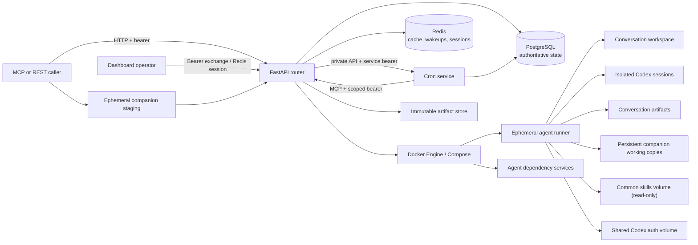
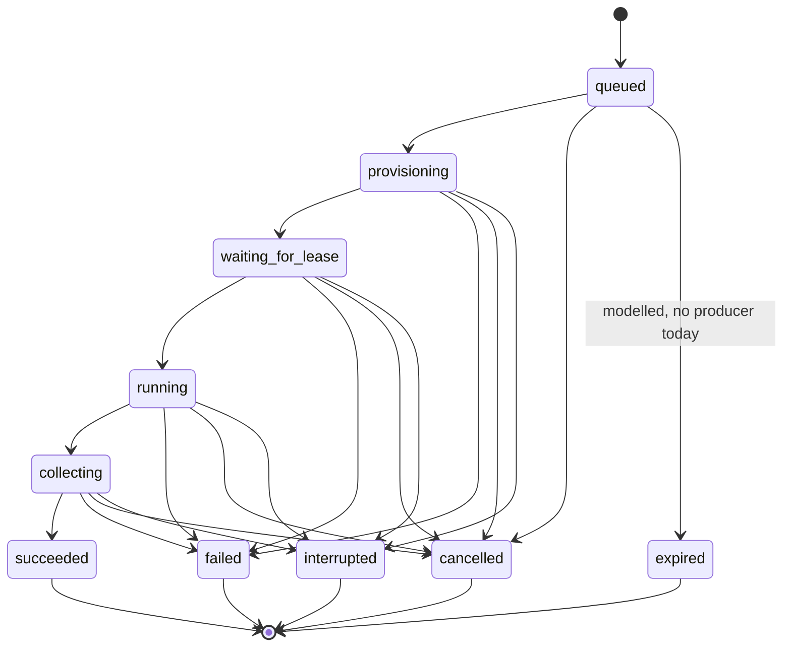
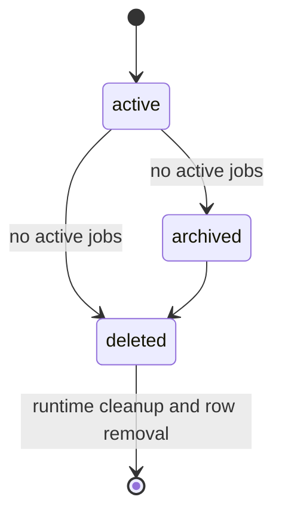

# RemoteAgent product and system requirements baseline

## Document control

| Field | Value |
|---|---|
| Document ID | RA-PRD-001 |
| Version | 1.4.0 |
| Status | Current implementation baseline |
| Baseline date | 2026-09-02 |
| Product release | RemoteAgent 0.4.0 / local image baseline |
| Intended deployment | Dedicated Linux Docker host on a trusted internal network |
| Owner | RemoteAgent maintainers |
| Approver | To be assigned |
| Review trigger | Any product, API, data-model, runtime, security-boundary, or operational change |

This document is both a product requirements document and a system requirements
baseline. It records what the repository implements now, what it implements only
partially, what is deliberately constrained, and what remains a gap. It is the
starting point for focused future changes; it is not a claim that every listed
production control has already been achieved.

The source-of-truth hierarchy is:

1. This document defines intended behavior, priorities, acceptance criteria, and
   known exceptions.
2. The [OpenAPI 3.1 contract](api/openapi.json), the normalized MCP
   [tools/list contract](api/mcp-tools-list.json), and the normalized MCP
   [resource templates contract](api/mcp-resource-templates-list.json) define
   machine-consumable client interfaces. The [cron internal OpenAPI](../cron/openapi.json)
   defines the private router-to-cron interface.
3. [Docker runtime and Compose contract](docker-runtime.md) defines the container
   execution boundary.
4. Code, migrations, and tests provide implementation evidence.

If these sources disagree, the discrepancy is a defect or an unapproved
requirements change. It must not be resolved by silently changing only one source.

### Revision history

| Version | Date | Change |
|---|---|---|
| 1.4.0 | 2026-09-02 | Added the repository-snapshot critic, risk-focused polyglot coverage artifacts, and a revisioned, managed command-network exception for controlled dependency restoration. |
| 1.3.0 | 2026-09-02 | Added staged uploads/public Git imports, persistent sequence-bounded conversation companions, safe archive/Git acquisition, companion API/MCP metadata, and bounded observability. |
| 1.2.0 | 2026-09-02 | Added the sibling cron service, seven MCP schedule/response tools, scoped service authentication, durable cron persistence/recovery, and cron-aware operations. |
| 1.1.0 | 2026-09-02 | Added the conversation-level model/reasoning execution profile, additive client fields, persistence migration, dashboard visibility, and explicit catalog-validation gap. |
| 1.0.0 | 2026-09-01 | Initial audited baseline of the implemented repository |

## Normative terminology

The terms **MUST**, **MUST NOT**, **SHALL**, **SHALL NOT**, **SHOULD**,
**SHOULD NOT**, and **MAY** are normative in the sense used by RFC 2119 and
RFC 8174 when capitalized.

Requirement status is independent of priority:

| Status | Meaning |
|---|---|
| Met | The current implementation satisfies the stated acceptance criteria. |
| Partial | Material behavior exists, but the full requirement or its verification is incomplete. |
| Gap | The requirement is not implemented or does not have enough evidence to claim it. |
| Constraint | This is an explicit boundary within which the current system is valid, not a capability claim. |

Priorities are:

| Priority | Meaning |
|---|---|
| P0 | Required to preserve the core product, durable data, or stated security boundary. |
| P1 | Required for a broadly production-hardened service or reliable operations. |
| P2 | Valuable enhancement that is not required for the current polling-based internal service. |

Verification methods are:

| Code | Method |
|---|---|
| T | Automated test |
| I | Static implementation/configuration inspection |
| D | Manual demonstration or live smoke test |
| O | Operational exercise, such as backup/restore or failure recovery |

## Purpose and success outcomes

RemoteAgent provides an internal MCP and HTTP control plane for isolated,
containerized Codex CLI agents. A successful deployment lets an authorized caller:

1. discover registered agents;
2. submit a prompt without holding the request connection open;
3. poll a durable job to completion;
4. continue the exact Codex conversation using an opaque conversation key;
5. optionally select and audit a model/reasoning profile when starting a
   conversation;
6. stage files, safe archives, or public Git history and attach persistent,
   editable companion data at an exact conversation-turn boundary;
7. retrieve immutable agent-produced artifacts;
8. inspect operational state through a protected dashboard and metrics endpoint;
9. add or revise reviewed host-local agent projects without rebuilding the router;
10. configure durable recurring agent turns and lease their successful responses;
11. operate, diagnose, back up, restore, and upgrade the service with repository
   tooling.

## Scope

### In scope

- A root router Compose project containing the router, sibling cron service,
  PostgreSQL, Redis, and Codex authentication helper.
- Any number of top-level agent folders, each with its own Compose project.
- Runtime registration of agent definitions whose files already exist on the
  server.
- Immutable agent definition, Codex configuration, and base-context revisions.
- Durable asynchronous jobs and polling.
- Exact multi-turn conversation continuation.
- Optional conversation-level model and reasoning-effort selection through REST
  and MCP.
- Single-use companion stages for streamed files/safe archives and asynchronous,
  full-history credential-free public HTTPS Git imports.
- Conversation-owned companion versions exposed as persistent editable working
  copies beneath `/workspace/companions/<name>`.
- Per-conversation workspaces, Codex sessions, control files, and artifact areas.
- Shared read-only skills and shared file-backed Codex authentication.
- Agent-specific dependency services started and health-checked by Compose.
- MCP Streamable HTTP and a versioned REST companion API.
- Cron schedule management and response leasing through MCP, backed by a
  private internal service API rather than public REST.
- Artifact resources and authenticated HTTP downloads.
- A read-only operational dashboard, bounded history, token telemetry,
  server-sent operational events, diagnostics, and Prometheus metrics.
- Deployment and maintenance scripts for a dedicated Linux Docker host.
- ChatGPT subscription authentication, with a deliberately narrow future
  API-key transition path.

### Non-goals for the current baseline

- Public-internet exposure without a TLS reverse proxy and additional hardening.
- Hostile multi-tenancy, unreviewed agent images, or untrusted agent definitions.
- Per-user, per-caller, or per-agent authorization.
- Remote upload of agent source, Compose files, images, or secrets through MCP.
- Private/authenticated Git, arbitrary URL fetching, companion downloads,
  automatic companion publishing, standalone companion removal, or
  cron-scheduled companion binding.
- More than one active router or cron replica, or automatic failover.
- Kubernetes or another orchestrator in place of Docker Compose.
- MCP job-completion notifications, webhooks, or guaranteed event delivery to
  callers; callers poll job status.
- Automatic retry of interrupted or failed Codex turns.
- Artifact malware scanning, content trust, or semantic validation.
- Companion malware scanning, quarantine, per-user ACLs, or encryption at rest.
- Exact attribution of hidden Codex instructions, tool definitions, internal
  context, or authentication material to token totals.
- A guarantee that an API-key deployment is production-ready until that mode has
  its own integration and live acceptance suite.
- Evaluation of model quality or humor; the joke agent validates workflow and
  output shape only.

## Actors

| Actor | Responsibility and trust |
|---|---|
| MCP caller | Discovers agents, stages public Git, polls stages/jobs, binds companions, preserves conversation keys, and reads resources using the shared bearer token. |
| REST client | Uses the versioned JSON API, including streamed companion upload, and authenticated artifact downloads. |
| Dashboard operator | Uses a bearer-derived browser session to inspect read-only operational data. |
| Platform operator | Owns the host, secrets, network controls, Docker daemon, backups, upgrades, and incident response. |
| Agent author | Creates a reviewed top-level agent project, image, context, configuration, and optional sidecars. |
| Router/API | Authenticates requests, validates definitions, persists durable intent, exposes MCP/REST/dashboard surfaces, and invokes Docker Compose. |
| Cron service | Persists schedules/executions/responses, calls the router through a scoped MCP role, and exposes a private authenticated API to the router. |
| Scheduler | Claims queued turns, enforces ordering and the subscription lease, runs agents, collects artifacts, and records terminal state. |
| Codex runner | Executes one Codex CLI turn inside an ephemeral agent container. |
| Docker Engine/Compose | Builds images, creates core services, starts health-checked sidecars, and creates/removes job containers. |
| PostgreSQL | Authoritative registry, revision, conversation, job, event, artifact, and lease store. |
| Redis | Performance-sensitive cache, event wake-up bus, rate counter, and dashboard session store; never the durable job authority. |

## Glossary

| Term | Definition |
|---|---|
| Agent | A named capability backed by a reviewed top-level Compose project and immutable registered revisions. |
| Agent definition | The complete executable snapshot: identity, Compose path/project/services, environment, labels, metadata, Codex TOML, and base context. |
| Agent revision | An immutable, checksummed definition snapshot identified by a monotonically increasing integer. |
| Phonebook | The checked-in seed registry. It creates missing agents but does not overwrite durable runtime revisions. |
| Runner service | The Compose service used for a short-lived Codex job container. |
| Dependency service | A manifest-listed Compose sidecar started before the runner and required to pass its health check. |
| Job or turn | One asynchronous prompt execution with a durable state and result. |
| Conversation | An ordered sequence of jobs associated with exactly one agent and one isolated runtime tree. |
| Conversation key | An opaque router identifier supplied on later turns; it is not the Codex thread ID. |
| Companion stage | Expiring, single-use acquisition state created by a streamed upload or asynchronous public Git import before prompt binding. |
| Conversation companion | A named, versioned, conversation-owned immutable source plus persistent editable working copy exposed at `/workspace/companions/<name>`. |
| Companion activation | Sequence-bounded preparation and atomic stable-link switch performed after predecessor turns are terminal and before Codex starts. |
| Codex thread ID | The exact Codex identifier stored by the router and passed to `codex exec resume`. |
| Execution profile | The conversation's nullable `model` and `reasoning_effort` selectors. A non-null value is forced on every turn; `null` means dynamic Codex/agent-config inheritance, not a discovered default. |
| Subscription lease | A renewable PostgreSQL lease with a fencing token that serializes subscription-backed execution. |
| Artifact | A changed regular file copied from a conversation artifact directory into immutable router storage and registered in PostgreSQL. |
| Common skills | A shared Docker volume mounted read-only in runners. |
| Control files | Router-materialized `AGENTS.md` and `config.toml` files mounted read-only for a turn. |
| Terminal job | A job in `succeeded`, `failed`, `cancelled`, `interrupted`, or `expired`. |
| Cron schedule | A caller-named recurring prompt with timezone-aware five-field timing, immutable revisions, and fresh or persistent conversation mode. |
| Cron execution | One persisted scheduled occurrence, uniquely identified by schedule generation and UTC firing time. |
| Response lease | A bounded, expiring claim over successful cron responses that are deleted only after acknowledgement. |

## Architecture and state overview



The root router is the only application service published on the host. Cron,
PostgreSQL, and Redis remain on the internal backend network. The router has the
Docker socket and therefore occupies a root-equivalent host trust position.
Agent runners do not receive the socket.

### Job lifecycle



Transient states may occur between polls. PostgreSQL terminal state is the
durable result. The `expired` state and transition exist in the model, but no
current worker assigns it; this is recorded as RA-JOB-009.

### Conversation lifecycle



There is no unarchive operation. A deletion tombstone is committed before
filesystem removal so a racing submitter cannot recreate the same key while its
new files are being deleted.

### Baseline invariants

The following are cross-cutting invariants:

- PostgreSQL is authoritative. Redis failure MUST NOT roll back accepted jobs.
- A conversation key MUST remain associated with one agent while it exists.
- Turns in one conversation MUST execute in sequence.
- A continuation MUST use the exact stored Codex thread ID and MUST NOT use a
  process-global “last” session.
- A non-null conversation model or reasoning effort MUST be reasserted on every
  new/resumed turn; a conflicting continuation MUST NOT mutate it.
- A queued job MUST execute the complete agent revision captured at submission.
- Idempotency replay MUST return the original job/companion additions before
  validating or consuming newly supplied stage IDs.
- A companion introduced at sequence N MUST NOT become visible to an earlier
  turn; once eligible, same-name replacement MUST be atomic.
- Accepted companion data MUST remain conversation-owned across introducing-job
  cancellation/failure and MUST follow conversation rather than job retention.
- Agent and artifact paths MUST remain inside their declared storage roots after
  symlink resolution.
- Agent-controlled configuration MUST NOT weaken the managed Codex policy.
- Shared auth and skills MUST NOT be copied into conversation artifacts or
  backups.
- External router bearer holders are equally authorized; the dedicated cron MCP
  bearer is restricted to the five execution/discovery tools required by cron.

## Requirement matrix

Each acceptance statement describes the evidence needed to change a status to
**Met**. Evidence names are repository-relative.

### General product requirements

| ID | Pri | Status | Requirement | Acceptance | Verification and evidence |
|---|---:|---|---|---|---|
| RA-GEN-001 | P0 | Met | The system MUST host multiple distinct agents, each rooted at `<repository>/<agent-id>/` and backed by its own Compose project. | At least two valid project-bounded definitions can be registered and discovered without path or project collision. | I: `phonebook.py`, `schemas.py`, `agents.py`; project-boundary tests cover one fixture and malformed peers. |
| RA-GEN-002 | P0 | Met | The external deployment bearer MUST authorize every enabled agent and all companion metadata; no per-user or per-agent ACL is promised. A distinct cron bearer MUST be limited to its five required MCP tools. | The external token has the full surface; the cron token can discover/invoke agents without companions but is rejected from staging/listing, non-empty companion bindings, REST, resources, operations, administration, and cron management; invalid credentials return HTTP 401. | T: HTTP/MCP auth and scoped-role tests; I: `security.py`, `mcp_server.py`. |
| RA-GEN-003 | P0 | Constraint | The current release SHALL run on one dedicated Linux Docker host with exactly one active router and one active cron replica. | Deployment documentation and validation prevent an operator from assuming active-active safety. A future HA change must redesign recovery/scheduling ownership and prove concurrency. | I: root `compose.yaml` has one of each; router recovery and cron firing are not an active-active contract. |
| RA-GEN-004 | P1 | Gap | Production owners MUST approve measurable availability, capacity, latency, RPO, and RTO objectives before declaring a general production service level. | Approved targets and load/recovery tests are recorded against this ID. | I: no SLO, capacity, RPO, or RTO baseline currently exists. |

### Agent registry and revision requirements

| ID | Pri | Status | Requirement | Acceptance | Verification and evidence |
|---|---:|---|---|---|---|
| RA-AGT-001 | P0 | Met | Callers MUST be able to list enabled agents, optionally include disabled agents, and retrieve one agent's current effective definition and revision. | MCP and REST discovery return stable IDs, names, descriptions, enabled state, and current revision; detail includes the effective configuration and base context. | T: HTTP/MCP discovery and joke workflow tests; I: `agents.py`, `api.py`, `mcp_server.py`. |
| RA-AGT-002 | P0 | Met | Runtime registration MUST accept only a definition whose Compose file already exists inside `<agents-root>/<agent-id>/`. It MUST NOT act as a source-upload API. | Absolute or relative paths resolve inside the agent root after symlink resolution; missing or escaping files are rejected. | T: `test_manifest_phonebook_is_project_bounded`; I: `validate_runtime_definition` in `phonebook.py`. |
| RA-AGT-003 | P0 | Met | Registration MUST be idempotent for an unchanged complete definition and MUST reject a changed definition unless replacement is explicit. | Re-registering the same snapshot retains the revision; changed input yields a conflict unless `replace=true`. | T: `test_agent_registration_is_idempotent_only_when_unchanged`. |
| RA-AGT-004 | P0 | Met | Every effective structural, configuration, or base-context change MUST create a complete immutable, checksummed revision; a queued job MUST retain its submitted revision. | Historic revisions reconstruct the complete executable definition and a queued job still resolves its original revision after replacement. | T: `test_full_agent_definition_is_immutable_per_revision`, `test_agent_snapshot_migration_backfills_live_v1_database`; I: migration `20260902_0002`. |
| RA-AGT-005 | P0 | Met | Concurrent partial configuration and base-context updates MUST serialize without losing either change. | Two concurrent partial updates produce ordered revisions and a current definition containing both values. | T: `test_concurrent_partial_agent_updates_are_serialized_and_merged`. |
| RA-AGT-006 | P0 | Met | The checked-in phonebook MUST seed missing agents only and MUST NOT overwrite durable runtime revisions on restart. Invalid entries SHOULD be isolated from valid entries. | A runtime override survives synchronization; valid agents load when a peer manifest is malformed. | T: phonebook seed and project-boundary tests; I: `load_phonebook_partial`. |
| RA-AGT-007 | P0 | Met | Agent-controlled Codex TOML MUST use a fail-closed allowlist, file credential storage, `approval_policy="never"`, and only `read-only` or `workspace-write` sandbox modes. The sole structured exception is `[sandbox_workspace_write].network_access: bool`; `true` requires explicit workspace-write mode. | Providers, backend URLs, MCP servers, hooks, notifications, plugins/apps, profiles, file readers, extra writable roots, every other structured value, and danger-full-access are rejected identically by the API and deployment validator. | T: config escape, exact network-table, validator-parity, and danger-full-access tests; I: `SAFE_CODEX_CONFIG_KEYS`, `remotectl validate`. |
| RA-AGT-008 | P0 | Met | Definitions MUST validate agent/project/service identifiers, duplicate or overlapping services, environment ownership, field types, and configured length limits. | Invalid slugs, reserved or `DOCKER_*` environment keys, duplicate dependencies, runner/dependency overlap, prompts over 2,000,000 characters, and contexts over 1,000,000 characters fail validation. | T: environment and request validation tests; I: `schemas.py`, `environment.py`, `remotectl validate`. |
| RA-AGT-009 | P0 | Partial | The resolved Compose model MUST contain the runner and every declared dependency, and every dependency MUST have a finite enabled health check. | Validation checks the runner and all dependency services plus non-disabled test, interval, timeout, retries, and finite start period. | T: `test_dependency_services_require_compose_healthchecks`; gap: current code verifies test presence only, not all timing fields or semantic health. |
| RA-AGT-010 | P0 | Partial | Every registered runner MUST comply with the runtime isolation, mount, label, networking, and resource contract in [Docker runtime and Compose contract](docker-runtime.md). | Registration rejects root execution, writable rootfs, missing capability drop or no-new-privileges, missing limits, Docker socket/unsafe writable mounts, undeclared host ports, and `container_name`. | I: templates comply; gap: `ComposeProjectValidator` does not enforce these controls. Runtime registration therefore remains restricted to reviewed definitions. |
| RA-AGT-011 | P1 | Partial | Operators SHOULD have an explicit, auditable way to enable or disable an agent without resubmitting unrelated structural fields. | A dedicated operation creates an audit event and changes discovery/intake atomically without rewriting the definition. | I: enabled state can currently change only through full replacement; no dedicated API or admin audit event exists. |

### Asynchronous job requirements

| ID | Pri | Status | Requirement | Acceptance | Verification and evidence |
|---|---:|---|---|---|---|
| RA-JOB-001 | P0 | Met | Prompt submission MUST be asynchronous and return a job ID, conversation key, queued status, nullable execution profile, and companion-addition echo without holding the connection for Codex execution. | REST returns HTTP 202 and MCP returns equivalent structured data only after any supplied stage bindings are durably accepted. | T: asynchronous joke/model/companion tests; I: `JobService.submit`. |
| RA-JOB-002 | P0 | Met | Job intent and lifecycle data MUST be durable in PostgreSQL, including prompt, agent revision, model/reasoning snapshot, status, result/error, usage, and timestamps. | Router or Redis restart does not erase an accepted job; all modeled states and the nullable execution profile are persisted values. | T: cache-outage tests and `test_model_selection.py`; I: `JobRecord`, migrations, `JobService`. |
| RA-JOB-003 | P0 | Met | A caller MUST be able to poll a job and receive its durable status and nullable execution profile and, when terminal, result, error, and usage. | Polling by exact job ID works through REST and MCP; clients are not required to observe every transient state. | T: joke workflow, HTTP/MCP tests, and `test_model_selection.py`; I: `get_prompt_status`, REST job GET. |
| RA-JOB-004 | P0 | Met | An optional idempotency key MUST be scoped to the agent and return the originally accepted job, execution profile, and companion additions on reuse before validating new payload fields. | The unique key is `(agent_id, idempotency_key)`; reuse returns the original snapshot even if later prompt, conversation, companion stages, model, or reasoning input differs, and newly supplied stages remain unclaimed. Documentation warns clients never to reuse a key for different logical work. | T: profile and companion replay tests; I: `JobService.submit`. Gap for a future stronger contract: no payload fingerprint or mismatch conflict. |
| RA-JOB-005 | P0 | Met | Jobs in one conversation MUST execute in sequence, and a queued successor MUST resolve the thread ID only after its predecessor is terminal. | Two queued turns produce ordered results and the second receives the exact thread established by the first. | T: `test_two_queued_turns_resume_the_exact_thread`. |
| RA-JOB-006 | P0 | Met | Subscription-backed Codex execution and dependency provisioning MUST be serialized deployment-wide by a renewable PostgreSQL lease with fencing. | Only the current lease holder provisions/runs; renewal loss terminates the turn; a stale holder cannot release a successor's lease. | I: `lease.py`, `scheduler.py`; gap: no real-PostgreSQL contention integration test. |
| RA-JOB-007 | P0 | Partial | A queued job MUST cancel immediately; an active job MUST observe cancellation and terminate. Execution MUST have a documented end-to-end deadline. | Automated tests cover queued, lease-wait, provisioning, running, and terminal cancellation plus deadline behavior. The deadline includes all lifecycle phases or each phase has its own bound. | I: cancel flag, terminate/kill, and Codex timeout exist; gap: current timeout wraps only `runtime.run`, not queue, lease wait, or dependency provisioning, and coverage is absent. |
| RA-JOB-008 | P0 | Met | On a single-router restart, previously active jobs MUST become `interrupted`, retain a diagnostic error, and have their exact job container reconciled. They MUST NOT be silently retried. | Startup marks provisioning, waiting, running, and collecting records interrupted and removes the deterministic worker container name. | I: `recover_interrupted`, runtime `recover`, application lifespan. |
| RA-JOB-009 | P1 | Gap | Intake MUST have approved queue bounds, admission control, and queued expiration behavior. | Load tests prove a defined maximum; excess intake returns a documented response; old queued work transitions to `expired` or another approved terminal state. | I: no queue bound, producer for `expired`, or pre-parse global request-body limiter exists. |
| RA-JOB-010 | P2 | Gap | The system MAY add a caller completion notification channel without replacing durable polling. | A versioned delivery contract defines authentication, retry, ordering, loss, and replay semantics; polling remains authoritative. | I: no MCP completion notification or webhook exists. Dashboard SSE is operational metadata only. |
| RA-JOB-011 | P1 | Partial | Lifecycle and administrative changes SHOULD produce a correlated audit trail that is useful without storing secrets or reasoning. | Events include request/job/conversation/revision correlation and administrative mutations; retention and access are defined. | I: durable job transition and thread events exist; caller identity and complete agent/config/conversation admin events do not. |

### Conversation requirements

| ID | Pri | Status | Requirement | Acceptance | Verification and evidence |
|---|---:|---|---|---|---|
| RA-CON-001 | P0 | Met | A new submission MUST receive an opaque generated conversation key unless the caller supplies a valid unused key. A key MUST remain associated with one agent. | Generated keys are non-predictive `c_<32 hex>`; invalid formats and attempts to move a key to another agent are rejected. | T/I: `PromptRequest` validation and `JobService.submit`; conversation conflict behavior in core code. |
| RA-CON-002 | P0 | Met | A continuation MUST invoke `codex exec resume` with the exact durable Codex thread ID and MUST NOT use `--last`. | First turn records `thread.started`; later turns pass that exact ID with isolated sessions. | T: exact resume argv and two-queued-turn tests. |
| RA-CON-003 | P0 | Met | Each conversation MUST have isolated workspace, companion source/working/link, Codex session, artifact, control, and job-output paths with owner-only host permissions. Effective control files MUST be mounted read-only for the turn. | Separate keys resolve to separate roots; companions remain conversation-local; materialized `AGENTS.md` and `config.toml` reflect the job revision and are read-only runner mounts. | T: exact resume/companion/materialization tests; I: `workspace.py`, `runtime.py`. |
| RA-CON-004 | P0 | Met | Archive and delete operations MUST reject conversations with active jobs. Archive MUST prevent new turns; delete MUST remove durable and runtime conversation data. | Operations return documented not-found/conflict outcomes; no new job can enter a non-active conversation. | I: `archive_conversation`, `delete_conversation`, REST/MCP mappings. |
| RA-CON-005 | P0 | Met | Conversation deletion MUST commit a tombstone before filesystem deletion to prevent an ABA recreation race. | An injected cleanup failure leaves a deleted tombstone and a concurrent/repeated submit cannot recreate the key. | T: `test_delete_tombstone_prevents_conversation_recreation_during_cleanup`. |
| RA-CON-006 | P1 | Partial | Inactive conversations MUST follow a configurable retention lifecycle; production owners SHOULD be able to apply an approved legal hold or export policy if required. | Automated retention tests prove age, active-job exclusion, tombstone retry, and file cleanup; any hold/export policy is documented. | I: 90-day default retention worker exists; gap: no dedicated retention suite or hold/export capability. |
| RA-CON-007 | P0 | Met | A new conversation MAY select `model` and `reasoning_effort`; each field MUST resolve from caller input, then the agent revision's explicit setting, then nullable inheritance. The router MUST persist the pair, snapshot it on each job, force every non-null value on new and resumed runs, and reject a conflicting non-replay continuation. | Tests cover request-over-agent precedence, agent defaults, null inheritance, persistence, exact-match/omitted continuations, HTTP 409 conflicts, idempotency replay precedence, and both new/resume CLI argument vectors. | T: `test_model_selection.py`; I: `schemas.py`, `jobs.py`, `runtime.py`, migration `20260902_0003`. |
| RA-CON-008 | P2 | Gap | A future caller-facing model discovery capability SHOULD report the authenticated Codex catalog and supported effort levels if preflight selection is required. | A versioned authenticated REST/MCP contract defines cache freshness and availability semantics and rejects or clearly warns on incompatible selections before queueing. | I: current validation is static only; account/model/effort mismatches fail asynchronously through normal job status. No discovery endpoint/tool/resource exists. |

### Conversation companion requirements

| ID | Pri | Status | Requirement | Acceptance | Verification and evidence |
|---|---:|---|---|---|---|
| RA-CMP-001 | P0 | Met | Callers MUST stage ordinary files, safe supported archives, and full-history credential-free public HTTPS Git repositories before prompt binding. Uploads MUST stream through REST; Git import MUST be asynchronous and pollable through REST/MCP. | Upload returns a ready single-use stage; Git returns `202` and transitions through queued/importing to ready or failed; the MCP body ceiling is not used for bytes. | T/I: companion upload/import service tests; `companions.py`, `api.py`, `mcp_server.py`. |
| RA-CMP-002 | P0 | Met | Upload staging MUST use owner-only temporary files, incremental SHA-256, size admission, and atomic finalization. Archive extraction MUST reject traversal, absolute/control paths, normalized duplicates, links, devices, special permission bits, excessive expansion, and excessive file count. | ZIP/TAR/TAR.GZ/TGZ happy paths and every malicious/archive-bomb class fail without publishing partial state. | T/I: archive/hash/partial-write/quota tests and extraction policy in `companions.py`. |
| RA-CMP-003 | P0 | Met | Git staging MUST accept only credential-free HTTPS endpoints whose pinned A/AAAA set is entirely globally routable; redirects, interactive credentials, inherited proxy/config, and non-HTTPS protocols MUST be disabled. It MUST pin a requested ref or remote HEAD to one commit and preserve full reachable history without automatically fetching submodules or LFS. | URL/IP/DNS/ref/history/timeout/size/restart tests prove the import policy and sanitized failure path. | T/I: Git companion tests and controlled subprocess environment in `companions.py`. |
| RA-CMP-004 | P0 | Met | Prompt submission MUST accept at most 20 unique stage/name bindings, lock the stages and conversation, promote verified sources, persist job/version rows, consume stages exactly once, and only then return `202`. Idempotency replay MUST occur first and leave newly supplied stages untouched. | Concurrent claim and replay tests yield one owner/version and preserve unused retry stages; rollback/reconciliation never reports acceptance without durable source intent. | T/I: companion binding/idempotency/concurrency tests; `jobs.py`, `companions.py`, migration `20260902_0004`. |
| RA-CMP-005 | P0 | Met | Companion activation MUST wait for predecessor terminal state and select the latest accepted version per name whose introducing sequence is visible to the runnable turn. Same-name replacement MUST keep the prior version visible until an atomic switch and MUST discard prior edits only after success. | Tests prove first-turn use, inheritance, edit persistence, future-turn isolation, queued replacements, cancelled introducers, and atomic replacement. | T/I: scheduler companion sequencing tests; `scheduler.py`, `companions.py`, `workspace.py`. |
| RA-CMP-006 | P0 | Met | Before every turn the router MUST verify/repair stable links and recreate a missing working copy from immutable source where possible. Preparation failure MUST fail before Codex, retain pending state/error, expose no partial copy, and retry on a later turn. | Missing/corrupt/link-repair fault injection proves fail-before-run and retry behavior. | T/I: companion activation/reconciliation tests. |
| RA-CMP-007 | P0 | Met | Active companions MUST produce a deterministic versioned router preamble listing name, stable path, kind, version, digest, and Git commit plus artifact-output guidance. The raw caller prompt MUST remain unchanged in SQL; runtime metadata and token accounting MUST use the visible/effective prompt. | Tests compare exact preambles, active-only visibility, runtime IDs/version, effective token estimates, and byte-identical legacy prompts without companions. | T/I: scheduler/runtime/telemetry companion tests. |
| RA-CMP-008 | P0 | Met | Accepted source/working bytes MUST follow conversation backup, archive, retention, and tombstone-first deletion, independent of introducing-job retention. Unclaimed staging MUST expire, be excluded from backups, and reconcile restored/missing/partial state safely. | Restart, job-retention, backup/restore, expiry, and conversation-delete tests preserve or remove exactly the documented boundary. | T/I/O: companion reconciliation/retention/migration tests and backup runbook. |
| RA-CMP-009 | P0 | Met | REST and MCP MUST expose stage status and conversation companion metadata with documented not-found/conflict/limit/validation/capacity semantics. Prompt acceptance/status MUST echo additions, and a new client MUST verify that echo before assuming an older server honored bindings. | OpenAPI and 20-tool MCP snapshots expose typed fields; parity/error/legacy-client tests pass. | T/I: contract/API/MCP companion tests and `docs/api/*`. |
| RA-CMP-010 | P0 | Constraint | V1 SHALL NOT add companion-content download, automatic publishing, standalone removal, private Git, generic URL fetching, or cron-scheduled companion binding. Companion bytes remain plaintext trusted-internal data without malware scanning, quarantine, per-user ACLs, or encryption at rest. | Public routes/tools contain no such operations; cron rejects non-empty bindings; security/operations documentation names the boundary. | T/I: scoped-role and contract tests; `security.py`, `docs/security.md`. |

### Cron scheduling and response requirements

| ID | Pri | Status | Requirement | Acceptance | Verification and evidence |
|---|---:|---|---|---|---|
| RA-CRN-001 | P0 | Met | MCP MUST expose seven typed tools to configure, list, inspect, enable/disable, and delete schedules and to lease/acknowledge responses. Cron routes and companion fields MUST NOT be added to its public/private schedule schemas. | Discovery exposes exactly 20 total tools; router calls the unchanged bearer-protected backend-only `/internal/v1` API whose OpenAPI contract is checked in, and the cron role rejects non-empty prompt bindings. | T/I: MCP contract/scoped-role tests, `cron/openapi.json`, router cron client. |
| RA-CRN-002 | P0 | Met | Schedule IDs MUST follow the lowercase slug policy; configure MUST verify an enabled agent, be an identical-input no-op, and append an immutable revision for any change. | Concurrent create/replace retains one current revision and complete prior snapshots; invalid/disabled agents fail before persistence. | T/I: cron service/repository tests and schedule models. |
| RA-CRN-003 | P0 | Met | Timing MUST use a strict timezone-aware five-field cron expression with conventional lists/ranges/steps/names and day-field OR behavior while rejecting macros, extensions, extra fields, invalid zones, and impossible expressions. | Deterministic clock tests cover grammar, next boundary, DST gaps, and the first-only repeated wall-clock minute. | T/I: cron-expression test suite and `croniter>=6.2.4,<7` validation wrapper. |
| RA-CRN-004 | P0 | Met | Each occurrence MUST be persisted before MCP submission and use a deterministic `(generation, scheduled_for_utc)` identity/idempotency key. Restart MUST safely retry an ambiguous submission, resume stored-job polling, and idempotently commit one success response. | Injected crashes before/after acceptance, polling, and response commit produce at most one router job and response for an occurrence. | T/I: recovery tests, unique constraints, MCP client structured-content parsing. |
| RA-CRN-005 | P0 | Met | Startup, schedule changes, and resume MUST choose the next future boundary with no catch-up. A nonterminal prior execution MUST cause later occurrences to be counted as skipped rather than queued. | Injected-clock tests prove no downtime replay, no overlap, persistent skip counters, and active/last execution projections. | T: scheduler tests. |
| RA-CRN-006 | P0 | Met | Runs MUST have a configurable default 24-hour deadline and bounded transport retries; at deadline cron MUST request cancellation and retain overlap exclusion until terminal status is confirmed. | Timeout/retry tests cover transient MCP loss, cancellation, and every router terminal state. | T/I: worker tests and Compose settings. |
| RA-CRN-007 | P0 | Met | Fresh mode MUST create a new conversation per occurrence; persistent mode MUST reuse continuity. Agent/model/reasoning/mode changes MUST clear future continuity while prompt/timing changes preserve it. | Revision/continuity tests prove active executions remain on their snapshot and only the defined fields reset the persistent key. | T: schedule revision tests. |
| RA-CRN-008 | P0 | Met | Only succeeded router jobs MUST produce responses containing complete result text, identifiers, timestamps, execution profile, and usage. Failures MUST remain bounded execution diagnostics, not queue records. | Terminal-state tests prove exactly one response for success and none for failed/cancelled/interrupted/expired jobs. | T/I: worker and response repository tests. |
| RA-CRN-009 | P0 | Met | Response retrieval MUST require exactly one schedule/execution selector, lease FIFO schedule batches or one exact execution response, enforce count/byte targets without stranding an oversized record, and return `more_available`. | Concurrent lease tests prove isolation, FIFO, size/count handling, and lease expiry availability. | T: response lease tests. |
| RA-CRN-010 | P0 | Met | Acknowledgement MUST atomically delete only rows still owned by the lease, be retry-idempotent through a 24-hour tombstone, and prevent a stale acknowledgement from deleting re-leased rows. | Concurrent expiry/re-lease/ack tests prove ownership and idempotency invariants. | T/I: acknowledgement tests and transaction constraints. |
| RA-CRN-011 | P0 | Met | Cron MUST own separate PostgreSQL tables and Alembic version state, retain unacknowledged responses for 90 days by default while honoring active leases, and cascade schedule-owned state after active deletion completes. | Migration up/down, TTL, active-delete, schedule-ID reuse, backup/restore, and no-cross-service-FK tests pass. | T/I/O: cron migrations/repository tests and core backup runbook. |

### Docker and Codex runtime requirements

The complete authoring and execution contract is specified in
[Docker runtime and Compose contract](docker-runtime.md). These requirements
summarize its product-level obligations.

| ID | Pri | Status | Requirement | Acceptance | Verification and evidence |
|---|---:|---|---|---|---|
| RA-DKR-001 | P0 | Met | The Codex base and each agent image MUST be built before runtime with required agent executables installed and material versions reviewed. A turn MUST NOT mutate the image or download arbitrary executable tooling. | A newly created runner can execute immediately; the repository critic obtains coverage executors from its pinned image and installs only target-project dependencies into isolated scratch under RA-DKR-010. | T/I: image contract tests, `runtime/agent.Dockerfile`, agent Dockerfiles, templates. |
| RA-DKR-002 | P0 | Met | One job MUST run through the exact registered Compose file, project, and runner service as an ephemeral `run --rm --no-deps` container with deterministic labels and name. | Command construction uses the immutable job revision; the worker is removed after success, failure, cancellation, or recovery. | I: `DockerComposeRuntime.run`, `_remove_worker_container`. |
| RA-DKR-003 | P0 | Met | The runner MUST receive only its isolated workspace/sessions/artifacts/control paths plus the shared auth and read-only common-skills volumes. It MUST NOT receive the Docker socket. | The reference template and joke agent resolve those mounts, and the router injects no controller secret into the runner environment. | I: template and joke Compose, `environment.py`, `runtime.py`. |
| RA-DKR-004 | P0 | Met | The router MUST start every manifest-listed dependency with Compose, wait for health, fail the job on startup failure, and stop idle dependencies after a bounded warm period. | `compose up -d --wait --wait-timeout` precedes the runner; release schedules a warm stop; router shutdown stops dependencies known to that process. | I: `provision`, `release`, `close` in `runtime.py`. Crash reconciliation of orphan warm sidecars remains a gap. |
| RA-DKR-005 | P0 | Constraint | Repository and state paths mounted into the router MUST use the same absolute paths as the host because child bind mounts are evaluated by the host Docker daemon. | Initialization records exact absolute paths and deployment validation rejects a mismatch. | I: root `compose.yaml`, `remotectl init/validate`, `architecture.md`. |
| RA-DKR-006 | P0 | Partial | Runners MUST be non-root with a read-only root filesystem, bounded tmpfs, all capabilities dropped, no-new-privileges, and PID/memory/CPU limits. The reviewed outer seccomp and AppArmor exceptions MAY exist only to run the inner Bubblewrap sandbox. | Registration enforces every setting and the no-network doctor probe proves auth denial plus workspace write behavior on the deployment host. | D: doctor and reference agent comply; gap: runtime registration does not enforce the Compose stanza. |
| RA-DKR-007 | P1 | Partial | Core router, PostgreSQL, and Redis containers SHOULD have explicit resource and privilege bounds appropriate to the host. | CPU, memory, and PID budgets are configured and load-tested; capability policy is reviewed; healthchecks and log rotation remain in place. | I: healthchecks, read-only roots, tmpfs, no-new-privileges, and log rotation exist; consistent resource/capability limits do not. |
| RA-DKR-008 | P0 | Partial | The deployment MUST support file-backed ChatGPT subscription authentication. An API-key mode MAY reuse the same router contract after separate qualification. | Headless ChatGPT login and a live two-turn smoke pass. API mode requires its own credential, model traffic, telemetry, and failure tests before its status becomes Met. | D/I: ChatGPT auth helper and live smoke exist; API-key helper/auth mode exists but has not been qualified end to end. |
| RA-DKR-009 | P0 | Met | Cron MUST run as a separate non-root backend-only container with read-only root, dropped capabilities, bounded tmpfs/CPU/memory/PIDs, and no Docker socket, Redis, repository/state, edge network, or Codex-auth access. | The resolved root Compose model contains the limits, no published cron port, only approved secret mounts, and a one-way dependency on healthy router. | T/I: Compose hardening tests, `compose.yaml`, `runtime/cron.Dockerfile`. |
| RA-DKR-010 | P0 | Partial | A reviewed agent MAY opt into managed command networking solely through its immutable `[sandbox_workspace_write].network_access=true` revision. The router MUST force the effective Boolean on every Codex invocation and MUST force `false` when the global sandbox is read-only. Runtime project dependency restoration MUST stay in bounded disposable workspace scratch, prefer checked-in locks, suppress install/build/generate hooks unless the current caller explicitly authorizes them, and publish exact provenance. | Default agents remain offline; the critic can restore credential-free dependencies only through the exact managed `pypi.org`, `files.pythonhosted.org`, `registry.npmjs.org`, `proxy.golang.org`, and `sum.golang.org` registry/proxy hosts (plus `example.com` for the release probe) without modifying the companion or image; unlocked resolution is labeled non-reproducible; local/private destinations, upstream proxies, and Unix sockets remain denied by managed policy. | T/I: config-policy, explicit true/false CLI override, scratch-runner, hook, provenance, and critic smoke tests; source contract pins all six hosts; non-model app-server `command/exec` probe proves default denial, critic HTTPS access to `example.com`, reachable unlisted-public-host denial, and loopback/private/Unix-socket denial. Missing: deterministic reachable link-local/metadata and DNS-rebinding fixtures plus an upstream-proxy bypass probe. |

### Artifact requirements

| ID | Pri | Status | Requirement | Acceptance | Verification and evidence |
|---|---:|---|---|---|---|
| RA-ART-001 | P0 | Met | The router MUST register only changed regular files under the conversation artifact root, reject traversal and symlink escape, enforce count/size limits, and copy bytes into owner-only immutable storage with SHA-256 metadata. | Changing or removing the source after ingestion does not alter the served copy; unsafe paths and excessive output fail collection. | T: `test_artifact_ingestion_creates_immutable_copy`; I: `artifacts.py`. |
| RA-ART-002 | P0 | Met | Callers MUST be able to list artifact metadata by job and/or conversation and receive an `artifact://` resource URI. | MCP and REST return ID, job, conversation, relative path, type, size, digest, and URI. | I: `ArtifactService.list`, REST and MCP artifact operations. |
| RA-ART-003 | P0 | Partial | MCP MUST serve artifacts no larger than 16 MiB as resources; larger files MUST remain available through authenticated HTTP with byte ranges, ETag, and private immutable caching. | Contract tests prove full, single-range, multipart-range, malformed, and unsatisfiable requests plus the 16 MiB MCP rejection. | I: implementation and machine contracts exist; gap: explicit Range/ETag/MCP-size automated coverage is incomplete. |
| RA-ART-004 | P0 | Met | Dashboard preview MUST render only bounded safe text or an explicitly sanitized raster derivative. Active content MUST be forced to attachment or generic binary type. | HTML/SVG/XML/JavaScript/PDF and unsafe raster originals cannot execute inline; filenames cannot inject headers. | T: `test_dashboard_artifacts.py`. |
| RA-ART-005 | P0 | Met | Artifact file size, files per job, and retention MUST be configurable with documented deployment defaults. | Limits are applied during secure copy and shown in the defaults table below. | I: `Settings`, `ArtifactService`, `RetentionWorker`. |
| RA-ART-006 | P1 | Gap | The immutable store SHOULD have orphan reconciliation, and production policy SHOULD define malware scanning or quarantine where artifacts cross trust boundaries. | A safe scanner reconciles DB/filesystem drift without deleting live content; scan/quarantine state is exposed and tested. | I: failed DB copy/delete can leave orphan files; no reconciler, malware scan, or quarantine exists. |

### MCP and REST API requirements

The wire-level source of truth is the checked-in
[OpenAPI 3.1 contract](api/openapi.json) for REST and the MCP-native normalized
[tools/list](api/mcp-tools-list.json) and
[resources/templates/list](api/mcp-resource-templates-list.json) results. MCP
runtime discovery remains authoritative for a negotiated session.

| ID | Pri | Status | Requirement | Acceptance | Verification and evidence |
|---|---:|---|---|---|---|
| RA-API-001 | P0 | Met | The router MUST expose MCP JSON-RPC 2.0 over stateless Streamable HTTP at `/mcp`, negotiate the MCP lifecycle, and apply configured Host and Origin protections. | A client can initialize, send `notifications/initialized`, list tools/templates, call tools, and read resources. Invalid Host/Origin/content negotiation receives the documented transport error. | T: HTTP/MCP initialization test; I: `build_mcp` and MCP SDK transport settings. |
| RA-API-002 | P0 | Met | MCP MUST expose exactly 20 current tools: 13 agent/job/companion/artifact/conversation tools plus seven cron schedule/response tools. It MUST expose agent configuration and artifact resource templates. | Normalized discovery matches the checked-in machine contracts and all successful tool results provide usable structured content. | T: MCP contract and structured-result tests; I: `mcp_server.py` and machine snapshots in `docs/api/`. |
| RA-API-003 | P0 | Met | MCP, core REST, metrics, and non-login dashboard data MUST require the bearer or a permitted dashboard session. Only `/health` and `/healthz` are public core endpoints. | Missing or invalid core bearer returns 401 with `WWW-Authenticate: Bearer`; public liveness remains reachable. | T: `test_http_bearer_and_mcp_mount`, dashboard auth and metrics tests. |
| RA-API-004 | P0 | Met | The router MUST expose a versioned JSON REST API under `/api/v1` for core agent, job, conversation companion, stage, and artifact operations, plus public liveness and authenticated readiness. | Versioned routes, methods, success codes, schemas, filters, limits, and domain errors match the OpenAPI contract; streaming upload remains a raw-body route and operational liveness/readiness behave as documented. | T: runtime OpenAPI drift and HTTP companion tests; I: `api.py` and machine OpenAPI artifact. |
| RA-API-005 | P0 | Partial | A checked-in OpenAPI 3.1 document MUST describe the supported REST client contract, including bearer security, standard error envelopes, binary/range responses, and stable operation IDs. | The document passes an OpenAPI 3.1 validator and a drift test against intentional application schemas/routes; operational health/dashboard/metrics surfaces are explicitly documented outside the versioned client contract. | T: `test_checked_in_client_contracts_match_implementation`, `test_runtime_serves_the_checked_in_openapi_contract`, and stable-operation/security assertions. Gap: no independent OpenAPI validator or configured CI workflow yet. |
| RA-API-006 | P0 | Partial | MCP client generation and validation MUST use the protocol's native JSON Schemas from `tools/list` and URI templates from `resources/templates/list`; OpenAPI MUST NOT be represented as the MCP protocol schema. | Machine snapshots are normalized, reviewed, and reproducible; human API guidance explains initialization, polling, structured outputs, errors, and resources. | T: MCP snapshot, precise-output-schema, and structured-wire-shape tests in `test_contracts.py`. Gap: no configured CI workflow yet. |
| RA-API-007 | P1 | Partial | The product MUST adopt an explicit API/MCP compatibility and deprecation policy. | Additive changes, breaking-change versioning, minimum deprecation window, SDK/protocol pinning, and contract-test gates are approved and documented. | I: `docs/api.md` defines additive/breaking rules and contract gates. Gaps: no minimum deprecation window, MCP SDK remains range-based, and server version currently follows SDK behavior. |
| RA-API-008 | P0 | Met | REST `PromptRequest` and MCP `submit_prompt` MUST accept optional `model` and `reasoning_effort`; `PromptAccepted` and `JobView` MUST expose the resolved nullable snapshot. | Runtime OpenAPI and MCP discovery advertise the fields and allowed static values; REST and MCP return matching profile values, and existing requests that omit them remain valid. | T: `test_model_selection.py` and checked-in contract drift tests; I: `schemas.py`, `api.py`, `mcp_server.py`, `docs/api/`. |

#### Current client-contract caveats

The following are current behavior and MUST be preserved or changed through the
change-control process:

- MCP completion is consumed by polling `get_prompt_status`; `GET /mcp` is
  not a job notification channel.
- The MCP transport has a 4 MiB request-body limit from the resolved SDK. This
  can reject a large multi-byte prompt before the model-level 2,000,000-character
  validation limit. Companion bytes therefore upload only through REST.
- MCP list tool structured results use a `result` wrapper. Clients SHOULD
  consume `structuredContent`, not reconstruct data from text blocks.
- REST domain errors are HTTP status plus `{"detail": ...}`; MCP tool domain
  errors are normal `tools/call` results with `isError=true`.
- Reusing an idempotency key with a different prompt, conversation, companions,
  model, or reasoning input still returns the original job, stored profile, and
  original companion additions without claiming newly supplied stages; clients
  MUST never reuse keys for different logical work.
- New clients that send companion bindings MUST verify the
  `companion_additions` echo so an older server cannot silently ignore the
  additive request field.
- Model and effort validation is static. Runtime discovery exposes no model
  catalog, so a syntactically valid unavailable combination can fail after
  asynchronous acceptance.
- Listing artifacts for an unknown job currently returns an empty list.
- `JobView` does not expose a nonterminal `cancel_requested` flag.
- MCP artifact resources always declare `application/octet-stream`, even when
  metadata has a more precise media type.
- The `/dashboard/api/v1` projection is an internal, read-only operational
  surface excluded from OpenAPI; it is not a supported application-client
  contract unless explicitly promoted by a future requirement.

### Data and reliability requirements

| ID | Pri | Status | Requirement | Acceptance | Verification and evidence |
|---|---:|---|---|---|---|
| RA-DAT-001 | P0 | Met | PostgreSQL MUST be authoritative for agents, revisions, companion lifecycle/claims, conversations, jobs, events, artifacts, and leases. Redis MUST NOT be required to commit or retrieve durable job state. | A Redis publication failure after SQL commit leaves the job and companion bindings accepted and pollable. | T: cache-outage and companion binding tests; I: models and services. |
| RA-DAT-002 | P0 | Met | Redis SHOULD accelerate activity delivery and store dashboard sessions with AOF persistence, while core job activity MAY degrade to process memory when Redis is unavailable. | Core submissions/polling continue during Redis loss; system status identifies the memory backend and dashboard-session impact. | I: `cache.py`, Redis Compose AOF configuration, dashboard system projection. |
| RA-DAT-003 | P0 | Partial | Readiness MUST distinguish a fully serviceable deployment from a degraded accelerator/dashboard and MUST fail when an enabled scheduler is not running. | `/readyz` returns 503 for unavailable mandatory dependencies or stopped enabled scheduler and explicitly reports optional Redis/dashboard degradation. | I: current readiness verifies SQL and the selected cache, so memory fallback can mask Redis loss; scheduler false is reported but does not change HTTP 200. |
| RA-DAT-004 | P0 | Met | Production schema changes MUST use Alembic under PostgreSQL transaction-scoped advisory locking and include compatible backfill and downgrade logic where feasible. Router and cron MUST own separate version chains. | Concurrent startup cannot race each component's migrations; cron uses `cron_alembic_version` and no cross-service foreign keys; existing router migrations preserve legacy behavior. | T: router and cron migration/locking tests; I: both migration trees and `remotectl migrate`. |
| RA-DAT-005 | P0 | Partial | Retention MUST commit database intent before external deletion and retry safely after partial filesystem failure. | Tests prove artifact, job, active-conversation, tombstone, and retry behavior without deleting live data or leaving untracked content indefinitely. | I: DB-before-filesystem and tombstone logic exists; gap: artifact/job orphan reconciliation and complete retention tests. |
| RA-DAT-006 | P0 | Partial | Backup MUST capture a consistent PostgreSQL dump including cron/companion state, the complete conversation tree (accepted sources and working copies included), immutable artifact store, version manifest, and checksums while excluding ephemeral unclaimed staging, credentials, secrets, Redis, images, and caches. | A scheduled operational exercise quiesces cron before the router idle check, creates/verifies/transfers a backup, and failures restart prior router/cron services in order; restored stage rows without ephemeral bytes become failed/expired. | I/O: `remotectl backup create/verify` and companion reconciliation implement the flow; no automated cadence, off-host transfer, or recurring exercise is supplied. |
| RA-DAT-007 | P0 | Partial | Restore MUST verify a strict archive allowlist and checksums before destructively replacing PostgreSQL and both runtime trees, require explicit confirmation with cron/router stopped, remove application objects absent from older archives, and restart router before cron. | SQL is fully rendered before one transactional `public`-schema reset/restore; a clean-host drill proves old cron rows cannot survive a pre-0.2 restore plus post-restore migration, discovery, continuation, and artifact integrity. | I/O: `remotectl restore` validates, transactionally replaces the application schema, swaps trees with a rollback attempt, and health-orders restart; no automated end-to-end restore drill or approved RTO exists. |
| RA-DAT-008 | P1 | Partial | Conversation state SHOULD be protected by enforced storage quotas and an approved data-at-rest policy. | Per-conversation/deployment limits reject or stop growth safely; database, volumes, and backups use approved host or application encryption and key management. | I: companion accepted-source and unclaimed-stage quotas exist, but general workspace/artifact/session growth remains unbounded and there is no app-layer encryption; deployment relies on a quota/monitored filesystem and host storage controls. |

### Security requirements

| ID | Pri | Status | Requirement | Acceptance | Verification and evidence |
|---|---:|---|---|---|---|
| RA-SEC-001 | P0 | Met | Initialization MUST generate independent high-entropy router, database, scoped cron-MCP, and cron-API secrets, restrict host file modes, and support explicit target-aware token rotation. | Secret files are non-empty and inaccessible to group/other; external rotation invalidates callers and internal rotation recreates router/cron with synchronized credentials. | I/T: `remotectl init/doctor/token`, settings/auth tests, Compose secrets. |
| RA-SEC-002 | P0 | Constraint | Plain HTTP SHALL be used only on an access-restricted trusted internal network. Any untrusted hop MUST use a correctly configured TLS reverse proxy and secure dashboard cookies. | Firewall scope is reviewed; after TLS, router binding and forwarded headers are constrained and `dashboard_allow_http=false`. | I: deployment/security docs and dashboard secure-transport enforcement. |
| RA-SEC-003 | P0 | Met | Child Compose processes MUST receive only allowlisted host values plus validated agent environment. Subscription mode MUST not inherit unrelated API credentials or controller secrets. | Reserved names and all `DOCKER_*` overrides are rejected; bearer, database URL/password, and host API keys do not enter runner environment. | T: environment override test; I: `environment.py`, runtime environment construction. |
| RA-SEC-004 | P0 | Partial | The runner image MUST contain a root-owned mode-0444 managed Codex policy that pins approval/sandbox/auth/backend controls, denies sandboxed auth reads, disables unneeded integrations outside the local command sandbox, and keeps command networking default-off with an exact managed six-host allowlist plus a private-network guard for reviewed opt-ins. The policy MUST enable the pinned local `codex-code-mode-host` while leaving the optional `code_mode` experiment disabled, because Codex 0.149.1 model metadata can independently select code-mode tools; no remote code-mode endpoint is permitted, and nested OS tools MUST retain normal managed sandbox enforcement. For pinned Codex 0.149.1, the policy MUST enable the proxy feature without setting the unconditional `experimental_network.enabled` requirement, and the router MUST pass an explicit effective per-run network Boolean. | The dummy-credential doctor probe proves default network denial, policy immutability, credential denial, workspace writing, and availability of the effective local code-mode feature plus its executable; the source contract pins every admitted host; the dedicated app-server probe proves default denial, HTTPS access to allowlisted `example.com` only for the critic, denial of an unlisted public host, and loopback/private-service/Unix-socket denial. Proxy runtime state remains mode 0700 beneath the existing `/tmp` tmpfs. | D/T/I: `remotectl doctor`, managed requirements contract, config escape/CLI-materialization tests, and `remotectl smoke network`. Missing: deterministic reachable link-local/metadata, DNS-rebinding, and upstream-proxy bypass probes; hostname policy does not constrain scheme, port, method, or payload for admitted hosts. |
| RA-SEC-005 | P0 | Constraint | Docker socket access and arbitrary agent images SHALL be treated as privileged, trusted-code boundaries. The bearer is not a host security boundary against a reviewed agent author. | Router runs only on a dedicated host; agent registration is operator-reviewed; threat documentation states that a custom image could bypass Codex and read shared auth. | I: router socket mount, shared auth mount, `security.md`. A future socket proxy/isolated worker is not implemented. |
| RA-SEC-006 | P1 | Gap | A broadened production deployment SHOULD enforce outbound network policy, service-wide rate/body limits, stronger secret management, and artifact/companion security controls. | Approved allowlists and limits are enforced and tested at proxy/application/runtime layers; secrets can be externally managed; suspicious content has defined handling. | I: Git URL/address/process controls and the critic's six-host Codex-sandbox allowlist exist, but there is no host-layer egress allowlist, global API/MCP rate limit, early global body limiter, external secret manager, or malware scan. |
| RA-SEC-007 | P1 | Partial | Stored prompts, responses, contexts, companions, and artifacts MUST have an explicit data classification, access, and retention policy. Raw model reasoning and credential-bearing stderr MUST NOT be persisted or displayed. | Policy identifies permitted content and incident deletion/export procedures; tests prove reasoning/secret redaction. | T: dashboard redaction tests; I: runtime stores stderr byte count only and security docs state companions are plaintext/in backups. Gap: all content is accessible to any shared-bearer holder and no PII classification policy exists. |
| RA-SEC-008 | P1 | Gap | Release artifacts SHOULD have reproducible dependency locking, digest pinning, SBOMs, vulnerability scanning, and provenance/signature verification. | CI fails on unapproved drift/severity and publishes signed image/SBOM attestations. | I: some runtime versions are pinned, but base images use tags, Python uses ranges, APT is unpinned, and no SBOM/sign/scan pipeline exists. |

### Dashboard and observability requirements

| ID | Pri | Status | Requirement | Acceptance | Verification and evidence |
|---|---:|---|---|---|---|
| RA-DSH-001 | P0 | Met | The router MUST host a read-only dashboard using either the bearer directly or a bearer-derived opaque browser session stored server-side. | Login is rate-limited; session IDs are hashed in Redis; idle and absolute expiry apply; cookie is HttpOnly, SameSite Strict, dashboard-scoped, and Secure when HTTP is disabled; logout validates CSRF; token rotation invalidates the session. | T: `test_dashboard_auth.py`, login/routes tests. |
| RA-DSH-002 | P0 | Met | The dashboard MUST show agents, active work, bounded jobs and prompt/response history, nullable model/reasoning profiles, read-only companion metadata, conversations, artifacts, and system state without becoming a write-control plane or companion download surface. | Protected pages and JSON projections expose current/limited historical data, including durable profiles and companion additions/state, with bounded previews and limits; untrusted names/errors render as text. | T/I: dashboard data/routes/safety tests; `dashboard/data.py`, `routes.py`, `dashboard.js`. |
| RA-DSH-003 | P0 | Met | Token telemetry MUST distinguish exact provider totals, local estimates, and unavailable attribution. Reasoning tokens MUST NOT be double-counted. | Terminal Codex usage is marked exact; visible text uses documented `ceil(UTF-8 bytes / 4)`; hidden context, tools, and `auth.json` are unavailable unless observed; provenance is shown per contributor. | T: `test_telemetry.py`, dashboard usage projection tests. |
| RA-DSH-004 | P0 | Met | Dashboard SSE MUST replay thin durable activity from PostgreSQL, use Redis only as a wake-up optimization, support `Last-Event-ID`, emit heartbeats, and bound replay. | Reconnect resumes after the cursor; more than 1,000 pending events produces a reset instruction rather than an infinite replay loop; event names cannot be injected. | T: `test_dashboard_sse.py`; I: `dashboard/sse.py`. |
| RA-DSH-005 | P0 | Met | Prometheus metrics MUST be bearer-protected and use bounded labels that exclude agent IDs, job IDs, conversation keys, companion/artifact names, stage IDs, source URLs/refs, IPs, and error text. | Metrics expose HTTP/auth/SSE/token plus companion status/byte/duration instruments and collapse unknown kind/status values to `other`. | T: metrics route and bounded-label tests; I: `telemetry.py`. |
| RA-DSH-006 | P0 | Met | Debug surfaces MUST be disabled by default and, when explicitly enabled, MUST remain read-only, bounded, recursively redacted, and free of raw reasoning and subprocess output. | Disabled endpoints return 404; bundles remain valid JSON no larger than 1 MiB and redact nested secret/token material. | T: dashboard diagnostics/data/routes tests. |
| RA-OBS-001 | P1 | Gap | Production metrics SHOULD expose queue depth/age, jobs by state and duration, failures, lease wait/loss, dependency startup, Docker cleanup, retention, backup age/result, and storage capacity. | Dashboards and alerts use bounded labels and cover approved service objectives and failure modes. | I: HTTP/auth/SSE/token and companion stage status/byte/duration instruments exist, but the broader production set and alert objectives remain absent; database summary is not a scrape-time substitute. |
| RA-OBS-002 | P1 | Gap | Application and administrative logs SHOULD be structured and correlated by safe request, job, conversation, and revision identifiers. | Logs have a documented schema, levels, redaction, rotation, correlation, and shipping policy; sensitive content is tested. | I: current application logging is sparse, mostly unstructured warnings without full correlation. |
| RA-OBS-003 | P0 | Partial | Liveness MUST report process availability, while readiness MUST fail when mandatory request-processing components are unavailable. | Public health remains shallow; authenticated readiness returns 503 for database loss or a stopped enabled scheduler and explicitly distinguishes Redis/dashboard degradation. | I: liveness and dependency query exist; gap: readiness currently remains 200 for scheduler false and memory cache can mask configured Redis loss. |

### Operations and lifecycle requirements

| ID | Pri | Status | Requirement | Acceptance | Verification and evidence |
|---|---:|---|---|---|---|
| RA-OPS-001 | P0 | Met | The repository MUST provide supported helpers for initialization, validation, router/cron/runner builds, auth/token/skills, lifecycle, logs, both migration chains, agents, smoke tests, backup/restore, cleanup, diagnostics, and upgrade. Destructive actions MUST require explicit confirmation. | `scripts/remotectl help` exposes each flow; `down` preserves volumes; cleanup is dry-run by default and scoped to deployment labels; no unscoped system prune is used. | I: `scripts/remotectl`, `Makefile`. |
| RA-OPS-002 | P0 | Met | A read-only doctor command MUST check host/runtime prerequisites, all secrets, Compose, images, the managed local code-mode feature and executable, managed sandbox behavior, auth, agent definitions/images, router health, authenticated cron database/schema/MCP readiness, and minimum free state disk. Credential mutation MUST refuse an active router. | A healthy deployment passes all checks; missing auth is explicit; the code-mode and sandbox probes use no network or model capacity, and the sandbox probe uses dummy credentials. | D/I: `remotectl doctor`, auth mutation guards. |
| RA-OPS-003 | P0 | Met | Upgrade MUST refuse a dirty checkout, validate, drain and stop intake, create a consistent backup, rebuild/recreate, and attempt to restart the prior router on failure. | An operator can retain the old checkout/images/backup and complete health, discovery, and smoke verification before accepting the release. | I: `remotectl upgrade apply`; no automatic database downgrade is promised. |
| RA-OPS-004 | P1 | Gap | Releases SHOULD be governed by CI and staging gates covering unit, contract, database, Redis, Docker, security, backup/restore, upgrade, and smoke behavior. | A protected pipeline publishes immutable versioned artifacts only after all gates and records rollback evidence. | I: no CI configuration, automated Compose integration, restore drill, image scan, or signed release process exists. |

### Test and validation requirements

| ID | Pri | Status | Requirement | Acceptance | Verification and evidence |
|---|---:|---|---|---|---|
| RA-TST-001 | P0 | Met | The repository MUST include a deterministic no-network workflow agent that returns one clean prompt-influenced joke and proves discovery, asynchronous execution, and exact continuation. | The two-turn test validates unique prompt/memory markers, one `JOKE:` paragraph, same conversation key, and exact stored thread resume without subscription usage. | T: `test_joke_agent_workflow.py`; I: `joke-agent/`. |
| RA-TST-002 | P0 | Met | Operators MUST have an opt-in live smoke test against authenticated Codex; it MUST refuse CI by default. | The smoke performs discovery, one new turn, one continuation, unique marker and shape checks, and preserves identifiers on failure. | D/I: `scripts/smoke_joke_agent.py`, `remotectl smoke live`. |
| RA-TST-003 | P1 | Partial | Automated acceptance SHOULD cover the production database/cache/runtime rather than relying predominantly on SQLite and fakes. | CI exercises real PostgreSQL advisory locks/contention, Redis failure/sessions, Docker isolation and sidecars, cancellation/timeouts, retention, artifact ranges, backup/restore, and API mode where supported. | T/I: the current unit suite covers core invariants, model profiles, and dashboard safety; the listed integration coverage is absent. |
| RA-TST-004 | P0 | Met | Companion tests MUST cover upload/archive/Git policy, quotas and concurrent admission, single-use/idempotent binding, sequence isolation and replacement, restart/retention/backup behavior, activation repair/failure, raw/effective prompts, REST/MCP parity, scoped cron rejection, dashboard escaping, telemetry labels, and migration contracts. | Deterministic local fixtures and injected faults exercise every class without contacting arbitrary external repositories or running uploaded code. | T/I: companion service, scheduler, API/MCP, security, telemetry, and migration tests. |
| RA-TST-005 | P0 | Met | The repository critic MUST review a complete companion snapshot against its own documentation, run existing tests, emit bounded machine-readable coverage/provenance artifacts, and prioritize uncovered high-risk behavior without inventing a universal percentage threshold. | Deterministic Python/JavaScript/Go harness tests plus an opt-in live companion smoke prove snapshot framing, documentation traceability, partial/failure states, hook suppression, unchanged input, and artifact shape. | T/I: critic contract/harness tests, `repository-critic/`, critic live smoke. |

## Current defaults and limits

These values describe the current repository and default Compose deployment.
They are requirements-controlled behavior, not recommended capacity claims.
Changing one requires a requirement impact review, code/spec documentation
updates, and proportionate tests.

### Network, scheduling, and execution

| Setting | Current value | Source and note |
|---|---:|---|
| Router host binding | `0.0.0.0:8080` | Root Compose; SHOULD become loopback behind a TLS proxy. |
| Cron binding | `0.0.0.0:8090` inside `backend` only | No host-published port. |
| MCP path | `/mcp` | Configurable, without a trailing slash. |
| REST prefix | `/api/v1` | Supported client REST contract. |
| Dashboard path | `/dashboard` | Enabled by default in Compose. |
| Scheduler workers | 4 | Compose-effective default; library default is 1. |
| Effective concurrent Codex turns | 1 | One global subscription lease, even with four scheduler workers and currently also in API auth mode. |
| Scheduler idle poll | 0.5 seconds | Library setting. |
| Subscription lease TTL | 21,600 seconds (6 hours) | Renewed at most every 60 seconds or one-third TTL. |
| Lease retry | 1 second | No fairness guarantee. |
| Codex run timeout | 14,400 seconds (4 hours) | Covers `runtime.run` only, not queue/lease/dependency wait. |
| Critic dynamic-work budget | 45 minutes | At most six project roots; restore 10 minutes and test suite 20 minutes apiece. |
| Critic scratch budget | 2 GiB | Process-group watchdog terminates work that exceeds the disposable workspace limit. |
| Dependency Compose wait | 120 seconds | `compose up --wait-timeout`. |
| Dependency warm retention | 900 seconds (15 minutes) | Zero disables warming. |
| Compose stop timeout | 30 seconds | Dependency stop. |
| Runner cancellation poll | 0.25 seconds | Process receives terminate, then kill after 10 seconds if needed. |
| MCP request-body limit | 4 MiB | Resolved MCP SDK behavior; not currently an explicit RemoteAgent setting. |
| Cron scheduler tick / job poll | 1 / 5 seconds | Configurable. |
| Cron run timeout | 86,400 seconds (24 hours) | Requests cancellation, then retains overlap exclusion until terminal. |
| Cron response lease | 300 seconds (5 minutes) | Expired leases become available again. |
| Cron response batch | 50 records / 4 MiB target | One oversized record is returned alone. |

### Identifiers and input

| Setting | Current value |
|---|---:|
| Agent ID | 1–63 lowercase slug characters; `^[a-z0-9][a-z0-9_-]{0,62}$` |
| Compose service name | 1–128 characters; `^[A-Za-z0-9][A-Za-z0-9_.-]{0,127}$` |
| Conversation key | 1–64 URL-safe characters beginning alphanumeric |
| Generated conversation key | `c_` plus 32 lowercase hexadecimal characters |
| Generated job ID | `j_` plus 32 lowercase hexadecimal characters |
| Generated artifact ID | `a_` plus 32 lowercase hexadecimal characters |
| Generated companion stage ID | `cs_` plus 32 lowercase hexadecimal characters |
| Companion logical name | 1–128 characters; one component matching `^[A-Za-z0-9][A-Za-z0-9._-]{0,127}$` |
| Cron schedule ID | Same 1–63 lowercase slug syntax as agent ID |
| Cron expression | Exactly five standard fields; no macros, seconds/year, random, or hashed extensions |
| Idempotency key | 1–256 characters, scoped to agent |
| Agent name | 1–128 characters |
| Agent description | At most 4,096 characters |
| Prompt | 1–2,000,000 characters, subject to transport byte limit |
| Model selector | Optional; `[a-z0-9][a-z0-9._-]{0,127}`; static syntax validation only |
| Reasoning effort | Optional; `minimal`, `low`, `medium`, `high`, `xhigh`, `max`, or `ultra`; compatibility is model/account dependent |
| Base context | At most 1,000,000 characters |
| Stored terminal error | At most 16,000 characters from scheduler failure conversion |

### Companion acquisition and ownership

| Setting | Current value | Note |
|---|---:|---|
| Upload body | 104,857,600 bytes (100 MiB) | Streamed; optional expected SHA-256. |
| Archive expanded tree | 104,857,600 bytes (100 MiB) | ZIP/TAR/TAR.GZ/TGZ safe extraction only. |
| Git bare mirror | 104,857,600 bytes (100 MiB) | Full reachable refs/history retained. |
| Git selected checkout | 104,857,600 bytes (100 MiB) | Independent writable checkout at pinned commit. |
| Files per extracted/imported tree | 20,000 | Regular files only for archive validation. |
| Companion additions per turn | 20 | Stage IDs and names must each be unique. |
| Active logical names per conversation | 200 | Same-name binding creates a new version. |
| Accepted immutable source per conversation | 1,073,741,824 bytes (1 GiB) | Superseded source bytes are reclaimed after atomic replacement. |
| Deployment-wide unclaimed staging | 5,368,709,120 bytes (5 GiB) | Exhaustion returns HTTP 507. |
| Stage expiry | 86,400 seconds (24 hours) | Applies to unclaimed staging. |
| Git import workers | 2 | Interrupted partial imports are cleaned and requeued. |
| Git import timeout | 300 seconds (5 minutes) | Failure text is bounded and sanitized. |
| Stable agent path | `/workspace/companions/<name>` | Editable working copy persists across turns. |

### Artifacts, history, and retention

| Setting | Current value | Note |
|---|---:|---|
| Artifact size per file | 104,857,600 bytes (100 MiB) | Configurable. |
| Changed artifacts per job | 1,000 | Configurable in application settings. |
| MCP artifact resource | 16 MiB maximum | Larger files use REST content endpoint. |
| Dashboard safe text preview | 256 KiB | Returned as JSON text, not executable markup. |
| Dashboard sanitized raster preview | 2 MiB | Only an explicitly safe derivative may render inline. |
| Artifact retention | 30 days | Age from artifact creation. |
| Terminal job retention | 90 days | Age from completion. |
| Conversation retention | 90 days | Inactivity, excluding active jobs. |
| Unacknowledged cron response retention | 90 days | An active lease remains valid through expiry. |
| Cron acknowledgement tombstone | 24 hours | Makes acknowledgement retry-idempotent. |
| Cron terminal execution retention | 30 days | Successful executions with queued responses remain protected by response references. |
| Cron cleanup interval | 1 hour | Configurable background maintenance cadence. |
| Retention scan interval | 1 hour | Background worker. |
| Dashboard history window | 30 days | View limit, not necessarily deletion. |
| Conversation turns shown | 100 default, 500 maximum | Dashboard projection. |
| Core REST job list | 100 default, 1,000 maximum | Reverse creation order, no cursor. |
| Core artifact/MCP list | Up to 1,000 | No cursor in the supported core API. |

### Dashboard, events, and diagnostics

| Setting | Current value |
|---|---:|
| Login attempts | 5 per source per 60-second bucket |
| Login form body | 16 KiB maximum |
| Browser session idle expiry | 1,800 seconds (30 minutes) |
| Browser session absolute expiry | 28,800 seconds (8 hours) |
| SSE heartbeat | 15 seconds |
| SSE durable poll | 5 seconds |
| SSE replay before reset | 1,000 events |
| Diagnostic bundle | 1 MiB maximum, 200 sequence elements, recursion depth 12 |
| Debug mode | Disabled |
| Plain-HTTP dashboard | Enabled by the reference internal Compose deployment; disabled by library default |

### Container and component versions

| Component | Current reference |
|---|---|
| RemoteAgent router package/API | 0.4.0 |
| RemoteAgent cron package/internal API | 0.2.0; behaviorally unchanged by companion support |
| Router/cron Python runtime | 3.12.11 |
| Repository critic Python runtime | 3.12.14 |
| Node runtime | 22.19.0 |
| Codex CLI | 0.149.1 |
| Docker CLI/Compose source image | 29.7.2 CLI |
| PostgreSQL | 17.6 Alpine |
| Redis | 7.4.5 Alpine |
| Cron expression library | `croniter>=6.2.4,<7` |
| Cron timezone database | Debian `tzdata` installed in the runtime image |
| Cron service resources | 512 MiB memory, 1 CPU, 128 PIDs, 64 MiB `/tmp` |
| Agent runner resources | 2 GiB memory, 2 CPUs, 256 PIDs, 64 MiB `/tmp` |
| Core JSON-file logs | 10 MiB per file, 5 files |
| Redis durability | AOF enabled, `appendfsync everysec`, snapshot after one change in 60 seconds |

Image tags and package ranges are not cryptographic supply-chain locks; see
RA-SEC-008.

## Production constraints and gap register

The current implementation can serve a trusted internal team when deployed
inside its stated boundary. It MUST NOT be described as hostile multi-tenant,
highly available, or internet-ready. The following register is the condensed
production risk view; requirement rows above remain authoritative.

| Area | Current constraint or gap | Governing IDs | Required disposition |
|---|---|---|---|
| High availability | One active router and cron only; peer replicas do not have an approved shared recovery/firing ownership model. | RA-GEN-003 | Document and enforce one replica of each, or redesign ownership/recovery before scaling horizontally. |
| Privileged trust | Router Docker socket is root-equivalent; reviewed custom images can read shared auth outside the inner Codex sandbox. | RA-SEC-005 | Dedicated host, restricted network, reviewed agents; future socket proxy/isolated workers for a broader boundary. |
| Compose enforcement | The reference runner is hardened, but registration does not validate the complete isolation/mount/network/resource contract. | RA-AGT-009, RA-AGT-010, RA-DKR-006 | Keep operator review mandatory; add resolved-model policy enforcement before delegated registration. |
| Network transport | V1 allows HTTP for the all-powerful external bearer on the internal network; internal service bearers remain Compose-backend only. | RA-GEN-002, RA-SEC-002, RA-CRN-001 | Firewall now; TLS and secure cookies before any untrusted external hop. |
| Queue/deadlines | No admission bound or queued expiry; timeout excludes queue, lease, and sidecar provisioning. | RA-JOB-007, RA-JOB-009 | Define capacity/deadline semantics and add failure tests. |
| Completion delivery | Application callers poll; no MCP completion notification exists. | RA-JOB-010, RA-API-001 | Preserve polling as durable contract; version any optional push mechanism. |
| Redis/readiness | Core jobs degrade to memory, but dashboard sessions require Redis and readiness can report 200 during configured degradation. | RA-DAT-002, RA-DAT-003, RA-OBS-003 | Correct readiness semantics and monitor Redis/dashboard separately. |
| Storage | No per-conversation byte quota; failed external deletes can leave orphan files. | RA-ART-006, RA-DAT-005, RA-DAT-008 | Dedicated monitored/quota filesystem now; add quota and reconciliation. |
| Data protection | Prompts, results, context, database, volumes, and backups rely on host access/encryption policy. | RA-SEC-007, RA-DAT-008 | Approve classification, retention, encryption, and incident procedures. |
| Observability | No queue/job/lease/runtime/backup/storage metrics, structured correlation, or complete admin audit trail. | RA-JOB-011, RA-OBS-001, RA-OBS-002 | Add bounded instruments, logs, audit events, alerts, and service objectives. |
| Recovery assurance | Backup/restore tooling exists but no approved cadence, off-host copy, automated restore drill, RPO, or RTO. | RA-DAT-006, RA-DAT-007, RA-GEN-004 | Establish recurring operational exercises and targets. |
| Contract governance | Machine contracts and normalized drift tests exist, but no configured CI gate, independent OpenAPI validation, minimum deprecation window, or fully pinned MCP SDK policy exists. | RA-API-005, RA-API-006, RA-API-007 | Enable the existing tests in CI, add independent validation, and approve the remaining release policy. |
| Model selection preflight | Conversation profiles accept statically valid selectors, but the router exposes no authenticated model catalog and cannot reject unavailable model/effort combinations before queueing. | RA-CON-008 | Poll asynchronous failures today; add versioned discovery and freshness semantics before promising preflight validation. |
| Supply chain and release | No CI release gates, digest locking, SBOM, signing, or scanning. | RA-OPS-004, RA-SEC-008, RA-TST-003 | Establish protected build/release pipeline. |
| API authentication mode | API-key helper exists, but the runtime is optimized and tested for ChatGPT subscription auth. | RA-DKR-008 | Keep API mode non-production until qualified. |

### Minimum conditions for the current internal deployment

An operator MAY call this baseline an internal production deployment only when:

1. it runs on a dedicated, patched Linux Docker host with one router and one cron replica;
2. port 8080 is firewalled to known callers, or a correctly configured TLS
   reverse proxy is used;
3. every registered agent directory, image, Compose file, context, and skill is
   reviewed as trusted code;
4. `.runtime` is on a dedicated quota-capable or closely monitored filesystem;
5. generated secret files retain owner-only permissions and Codex authentication
   is valid;
6. `remotectl validate --all` and `remotectl doctor` pass, including the
   inner sandbox probe;
7. a verified, recoverable backup exists outside the failure domain and an
   operator has rehearsed the restore process;
8. Docker, kernel, AppArmor, Codex, and image upgrades repeat sandbox and smoke
   acceptance;
9. users understand that the bearer grants access to all prompts, responses,
   agents, and artifacts and that artifacts remain untrusted downloads;
10. the owner accepts the open P1 gaps or assigns tracked remediation releases.

## Traceability

### Implementation areas

| Requirement families | Primary implementation evidence |
|---|---|
| RA-GEN, RA-AGT | `router/src/remoteagent/agents.py`, `phonebook.py`, `schemas.py`, `compose.py`, `environment.py`, `phonebook.toml` |
| RA-JOB, RA-CON | `jobs.py`, `scheduler.py`, `lease.py`, `runtime.py`, `workspace.py`, `conversation_lock.py` |
| RA-CMP | `companions.py`, `jobs.py`, `scheduler.py`, `workspace.py`, companion models/migration, REST/MCP companion surfaces |
| RA-DKR | Root and agent `compose.yaml`, `runtime/*.Dockerfile`, runtime entrypoints, `templates/agent/`, `joke-agent/`, `repository-critic/` |
| RA-CRN | `cron/`, cron migrations/OpenAPI, router cron MCP/client integration, root `compose.yaml` |
| RA-ART | `artifacts.py`, core artifact routes/resources, dashboard artifact handlers |
| RA-API | `api.py`, `mcp_server.py`, `security.py`, `app.py`, `docs/api/*` |
| RA-DAT | `models.py`, `db.py`, `migration.py`, `migrations/`, `cache.py`, `retention.py` |
| RA-SEC | `security.py`, `environment.py`, `schemas.py`, `runtime/codex-requirements.toml`, Compose security settings, `scripts/remotectl` |
| RA-DSH, RA-OBS | `dashboard/`, `telemetry.py`, `cache.py` |
| RA-OPS | `scripts/remotectl`, `Makefile`, deployment/operations/security documents |
| RA-TST | `router/tests/`, live smoke scripts, `joke-agent/`, `repository-critic/` |

### Automated evidence

| Evidence | Requirements primarily covered |
|---|---|
| `test_agent_environment_cannot_override_docker_controller` and config rejection tests | RA-AGT-007, RA-AGT-008, RA-SEC-003, RA-SEC-004 |
| Agent idempotency, seed, immutable revision, concurrent update, and migration tests | RA-AGT-003 through RA-AGT-006, RA-DAT-004 |
| Dependency healthcheck test | RA-AGT-009 |
| Deletion tombstone and cache outage tests | RA-CON-005, RA-DAT-001, RA-DAT-005 |
| Exact two-turn resume and argv tests | RA-JOB-005, RA-CON-002, RA-CON-003 |
| Model-profile resolution, continuation, idempotency, migration, runtime-argv, dashboard, REST, and MCP tests | RA-JOB-001 through RA-JOB-004, RA-CON-007, RA-API-008, RA-DAT-004, RA-DSH-002 |
| Companion upload/archive/Git, binding, activation, reconciliation, API/MCP, migration, dashboard, and telemetry tests | RA-CMP-001 through RA-CMP-010, RA-TST-004, RA-API-002, RA-DSH-002, RA-DSH-005 |
| Phonebook boundary test | RA-AGT-002, RA-AGT-006 |
| Immutable artifact copy and dashboard artifact safety tests | RA-ART-001, RA-ART-004 |
| HTTP bearer/MCP initialization test | RA-GEN-002, RA-API-001, RA-API-003 |
| Checked-in OpenAPI/MCP snapshot and structured-output contract tests | RA-API-002, RA-API-005, RA-API-006, RA-API-007 |
| Cron schedule, recovery, response lease, migration, and integration tests | RA-CRN-001 through RA-CRN-011, RA-DKR-009 |
| Dashboard auth, data, route, SSE, diagnostics, and telemetry tests | RA-DSH-001 through RA-DSH-006 |
| Deterministic joke workflow test | RA-JOB-001, RA-JOB-003, RA-CON-001, RA-TST-001 |

The existing suite is evidence for a requirement only to the extent stated in
its row. Passing unit tests do not close operational, real-PostgreSQL, Redis,
Docker, security-policy, or recovery acceptance criteria.

### Machine and human contract links

- [REST OpenAPI 3.1](api/openapi.json)
- [Cron internal OpenAPI 3.1](../cron/openapi.json)
- [MCP normalized tools/list](api/mcp-tools-list.json)
- [MCP normalized resources/templates/list](api/mcp-resource-templates-list.json)
- [Docker Runtime and Compose Contract](docker-runtime.md)
- [Architecture](architecture.md)
- [Agent authoring](agent-authoring.md)
- [Deployment](deployment.md)
- [Operations](operations.md)
- [Security](security.md)

## Change control

### Stable requirement identifiers

1. Requirement IDs are permanent. They MUST NOT be renumbered, reused, or
   silently deleted.
2. A retired requirement remains in the document with its final disposition and
   replacement ID.
3. A change to normative meaning, status, priority, default, or acceptance
   criteria increments this document version and adds a revision-history entry.
4. A gap becomes **Met** only when its complete acceptance criterion has evidence;
   shipping partial code changes its status to **Partial**, not **Met**.

### Required change impact statement

Every focused change MUST identify:

- targeted requirement IDs and current status;
- exact desired behavior delta and explicit non-goals;
- REST, MCP, dashboard, Docker, configuration, and CLI compatibility impact;
- database/filesystem migration, backfill, retention, backup, and rollback impact;
- threat-boundary, credential, network, artifact, and data-classification impact;
- new metrics, logs, alerts, debug data, and redaction behavior;
- deterministic, integration, operational, and live acceptance evidence;
- documents and machine contracts to regenerate;
- owner, target release, rollout plan, and rollback trigger.

### Compatibility rules

- Additive compatible fields MAY enter REST v1 or existing MCP tools only when
  older clients can ignore them and contract snapshots are updated.
- Removing/renaming fields, changing meaning, tightening accepted input in a way
  that breaks deployed clients, or changing state/idempotency semantics requires
  a new version or an approved deprecation period.
- MCP runtime discovery is authoritative, but checked-in normalized snapshots
  MUST be regenerated and diffed during review.
- Dashboard JSON is internal today. Promoting it to a supported client contract
  requires typed schemas, versioning, and an OpenAPI decision.
- Default and limit changes require load, failure, storage, and compatibility
  analysis; environment examples and this document MUST change together.

### Data and migration rules

- Every schema change MUST include an Alembic migration, concurrency-safe
  deployment behavior, backfill strategy, backup/restore compatibility, and
  downgrade or explicit irreversible-migration decision.
- A change that touches conversation paths, sessions, revisions, thread IDs, or
  artifact storage MUST demonstrate continuation and recovery across upgrade.
- Destructive retention or cleanup changes MUST be dry-run capable where
  practical and prove that active data cannot be selected.

### Docker and security rules

- Changes to Codex CLI, Node, Python, Docker, the host kernel, AppArmor, seccomp,
  Bubblewrap, mounts, UID/GID, or managed requirements MUST rebuild every agent
  image and pass the default-off doctor probe plus deterministic and staging live
  smoke acceptance, including positive and private/local-negative probes for any
  network-enabled agent.
- Expanding agent configuration keys, writable paths, integrations, environment,
  network access, or Docker permissions is a security-boundary change requiring
  threat review.
- Agent templates and resolved-model validation MUST be updated together when
  the runtime contract changes.

### Definition of done

A requirement-driven change is complete only when:

1. code, migrations, configuration, and safe rollback are implemented;
2. acceptance criteria have proportionate automated or recorded operational
   evidence;
3. machine contracts and relevant human documents agree;
4. observability and redaction cover new failure modes;
5. security and data impacts are reviewed;
6. requirement status/evidence and revision history are updated;
7. staging validation and any required live smoke pass before production rollout.

### Focused change proposal template

```markdown
# Change: <short title>

- Requirement IDs:
- Owner / target release:
- Current behavior and status:
- Desired behavior:
- Non-goals:
- Compatibility impact:
- Data migration and rollback:
- Security and privacy impact:
- Observability:
- Acceptance tests and operational evidence:
- Contract and documentation updates:
- Rollout and rollback triggers:
```

Using this template keeps future work anchored to a small, reviewable set of
stable requirements while preserving the larger system boundary.
